# CLARA — Comprehensive System Architecture

> **Document Type:** Master Architecture Reference
> **Version:** 2.0
> **Date:** January 2025
> **Classification:** Internal — Engineering & Architecture
> **Audience:** Engineering Team, Technical Leadership, AI/ML Engineers, Stakeholders
> **Cross-References:** All documents in `docs/proposal/` and `docs/research/`

---

## Table of Contents

1. [Architecture Vision](#1-architecture-vision)
2. [System Architecture Diagram — Complete](#2-system-architecture-diagram--complete)
3. [Layer 1: User Interaction & Security](#3-layer-1-user-interaction--security)
4. [Layer 2: Multi-Tier Classification & Routing](#4-layer-2-multi-tier-classification--routing)
5. [Layer 3: Core Agents & Workflow Router](#5-layer-3-core-agents--workflow-router)
6. [Layer 4: Smart Router & Knowledge Sources](#6-layer-4-smart-router--knowledge-sources)
7. [Layer 5: RAG Pipeline (Detailed)](#7-layer-5-rag-pipeline-detailed)
8. [Layer 6: Output, Audit & Blockchain](#8-layer-6-output-audit--blockchain)
9. [Supplementary Diagrams](#9-supplementary-diagrams)
   - 9.1 [Two-Layer Intent Router](#91-two-layer-intent-router-detail)
   - 9.2 [RAG Pipeline Detail](#92-rag-pipeline-detail)
   - 9.3 [FIDES Fact-Checking Pipeline](#93-fides-fact-checking-pipeline)
   - 9.4 [AI Council (Hội chẩn)](#94-ai-council-hội-chẩn)
   - 9.5 [Cache Architecture](#95-cache-architecture)
   - 9.6 [Vietnamese NLP Pipeline](#96-vietnamese-nlp-pipeline)
   - 9.7 [Doctor Workflow — Sub-Agent Architecture](#97-doctor-workflow--sub-agent-architecture)
   - 9.8 [Research Workflow — Progressive Display](#98-research-workflow--progressive-display)
   - 9.9 [Emergency Fast-Path](#99-emergency-fast-path)
   - 9.10 [Drug Normalization Pipeline](#910-drug-normalization-pipeline)
   - 9.11 [Infrastructure & DevOps](#911-infrastructure--devops)
10. [Technology Stack Reference](#10-technology-stack-reference)
11. [Model Stack Reference](#11-model-stack-reference)
12. [API Rate Limits & External Dependencies](#12-api-rate-limits--external-dependencies)

---

## 1. Architecture Vision

CLARA (Clinical Agent for Retrieval & Analysis) is a **Vietnamese Medical AI Assistant** built on an Agentic RAG architecture spanning **7 architectural layers**:

| Layer | Name | Purpose | Latency Budget |
|-------|------|---------|---------------|
| 1 | User Interaction & Security | PII filtering, anonymization, query processing | <50ms |
| 2 | Classification & Routing | Emergency check, role classification, intent routing | <100ms |
| 3 | Core Agents & Workflows | Literature, Safety, Medical Coding agents; workflow routing | Variable |
| 4 | Smart Router & Knowledge Sources | Context analysis, semantic matching, source selection | <200ms |
| 5 | RAG Pipeline | Aggregation, chunking, re-ranking, synthesis, verification | 1-20min |
| 6 | Output & Audit | Response streaming, blockchain audit, documentation | <500ms |
| 7 | Infrastructure | DevOps, monitoring, GPU inference, databases | Always-on |

**Three Workflow Tiers** serve distinct user segments:
- **Tier 1 — Simple** (<2 min): Normal users, single-pass RAG, lite fact-check
- **Tier 2 — Research** (5-20 min): Researchers, multi-source RAG, Perplexity-style streaming, full FIDES
- **Tier 3 — AI Council** (<20 min): Doctors only, multi-specialist deliberation (Hội chẩn), live processing logs

---

## 2. System Architecture Diagram — Complete

> **This is the master diagram** — the single source of truth for CLARA's end-to-end architecture.
> All 6 layers from the original Mermaid diagram are enhanced with details from 15,000+ lines of documentation.

```mermaid
graph TD
    %% ═══════════════════════════════════════════════════════════
    %% STYLE DEFINITIONS
    %% ═══════════════════════════════════════════════════════════
    classDef user fill:#ffffff,stroke:#333,stroke-width:2px,color:#000000;
    classDef security fill:#fff8e1,stroke:#f57f17,stroke-width:2px,color:#000000;
    classDef optim fill:#fffde7,stroke:#fbc02d,stroke-width:2px,stroke-dasharray: 5 5,color:#000000;
    classDef parallel fill:#e3f2fd,stroke:#1565c0,stroke-width:2px,color:#000000;
    classDef litFill fill:#e1bee7,stroke:#4a148c,stroke-width:2px,color:#000000;
    classDef safeFill fill:#ffccbc,stroke:#bf360c,stroke-width:2px,color:#000000;
    classDef codingFill fill:#bbdefb,stroke:#0d47a1,stroke-width:2px,color:#000000;
    classDef external fill:#e8f5e9,stroke:#2e7d32,stroke-width:2px,color:#000000;
    classDef ragProcess fill:#f3e5f5,stroke:#7b1fa2,stroke-width:2px,color:#000000;
    classDef specDecoding fill:#e0f7fa,stroke:#006064,stroke-width:2px,stroke-dasharray: 3 3,color:#000000;
    classDef output fill:#eceff1,stroke:#37474f,stroke-width:2px,color:#000000;
    classDef emergency fill:#ffebee,stroke:#c62828,stroke-width:2px,color:#000000;
    classDef roleClass fill:#e8eaf6,stroke:#283593,stroke-width:2px,color:#000000;
    classDef intentClass fill:#e0f2f1,stroke:#00695c,stroke-width:2px,color:#000000;
    classDef blockchain fill:#e0f2f1,stroke:#00695c,stroke-width:2px,stroke-dasharray: 5 2,color:#000000;
    classDef vnNLP fill:#fce4ec,stroke:#880e4f,stroke-width:2px,color:#000000;
    classDef cacheStyle fill:#fff3e0,stroke:#e65100,stroke-width:2px,color:#000000;

    %% ═══════════════════════════════════════════════════════════
    %% LAYER 1: USER INTERACTION & SECURITY
    %% ═══════════════════════════════════════════════════════════
    subgraph L1_User ["① User Interaction & Security Layer"]
        User([🧑 User Query]) --> UI["Giao diện CLARA<br/>(Next.js + React)"]
        UI --> API_GW["API Gateway<br/>(Kong/Traefik + JWT Auth<br/>+ Rate Limiting)"]
        API_GW -->|Raw Data| PII_Filter{{"🔒 PII/PHI Filter<br/>(Regex + NER)"}}
        PII_Filter -- "Sensitive Data" --> Anonymizer["🔐 Anonymization Module<br/>(Hash + Tokenize PII)"]
        Anonymizer --> VN_NLP
        PII_Filter -- "Clean" --> VN_NLP["🇻🇳 Vietnamese NLP<br/>(NFC Normalize<br/>+ Diacritics Restore<br/>+ Word Segmentation)"]
        VN_NLP --> Query_Proc["Query Processor<br/>(Medical NER<br/>+ Entity Extraction<br/>+ ICD-11 / RxNorm Mapping)"]
    end

    %% ═══════════════════════════════════════════════════════════
    %% LAYER 2: CLASSIFICATION & ROUTING
    %% ═══════════════════════════════════════════════════════════
    subgraph L2_Class ["② Multi-Tier Classification & Routing"]
        Query_Proc --> Emerg_Check{{"🚨 Emergency Check<br/>(Fast-path Bypass)<br/>Keywords: co giật, ngừng thở,<br/>đau ngực, xuất huyết,<br/>ngộ độc, tự tử..."}}

        Emerg_Check -- "🔴 EMERGENCY" --> Fast_Path["⚡ Fast-Path Alert<br/>(< 1 second)<br/>115 + First-Aid<br/>+ Nearest Hospital"]

        Emerg_Check -- "✅ No Emergency" --> Layer1_Role{{"Layer 1: Role Classifier<br/>Model: Qwen2.5-0.5B<br/>Latency: < 20ms"}}

        Layer1_Role -- "normal_user<br/>(conf > 0.7)" --> Layer2_Normal["Layer 2A: Normal Intent<br/>• general_info<br/>• symptom_check<br/>• med_query<br/>• prevention<br/>• emergency<br/>• navigation<br/>• clarification"]
        Layer1_Role -- "researcher<br/>(conf > 0.85)" --> Layer2_Research["Layer 2B: Research Intent<br/>• deep_research<br/>• drug_analysis<br/>• clinical_trial<br/>• evidence_synth<br/>• guideline_analysis<br/>• stat_inquiry<br/>• mechanism<br/>• methodology"]
        Layer1_Role -- "doctor<br/>(verified)" --> Layer2_Doctor["Layer 2C: Doctor Intent<br/>• diagnosis (DDx)<br/>• treatment_plan<br/>• drug_interact (DDI)<br/>• dose_adjust<br/>• peer_consult<br/>• protocol_lookup<br/>• case_review<br/>• second_opinion"]

        Layer2_Normal & Layer2_Research & Layer2_Doctor --> Route_Workflow(("Route to<br/>Workflow"))
        Route_Workflow --> Cache_Check{{"📦 Cache Check<br/>(4-Layer: Redis → PG<br/>→ Embedding → Freshness)"}}
    end

    %% ═══════════════════════════════════════════════════════════
    %% LAYER 3: CORE AGENTS & WORKFLOW ROUTING
    %% ═══════════════════════════════════════════════════════════
    subgraph L3_Agents ["③ Core Agents & Workflow Router"]
        Cache_Check -- "✅ Cache Hit" --> Stream_Engine
        Cache_Check -- "❌ Cache Miss" --> Workflow_Router{{"Workflow Router<br/>(Intent-Based)"}}

        Workflow_Router -- "Tier 1: Simple<br/>(< 2 min)" --> T1_Flow["Tier 1 Workflow<br/>(Single-source RAG<br/>+ Quick Synthesis<br/>+ Basic Check)"]
        Workflow_Router -- "Tier 2: Research<br/>(5-20 min)" --> T2_Flow["Tier 2 Workflow<br/>(Multi-source RAG<br/>+ Progressive Stream<br/>+ Full FIDES)"]
        Workflow_Router -- "Tier 3: AI Council<br/>(< 20 min)" --> T3_Flow["Tier 3 Workflow<br/>(Multi-Specialist<br/>+ Deliberation<br/>+ Full FIDES + Logs)"]

        T1_Flow --> Coding_Agent["🔧 Medical Coding Agent<br/>(Tool Orchestrator — SLM)<br/>Builds API queries,<br/>selects sources"]
        T2_Flow --> Lit_Agent["📚 Literature Agent<br/>(SLM)<br/>PubMed search,<br/>evidence synthesis"]
        T2_Flow --> Safety_Agent["⚠️ Safety Agent<br/>(SLM)<br/>DDI check, dosage,<br/>contraindications"]
        T3_Flow --> Council_Agent["🏥 AI Council Orchestrator<br/>(Multi-Specialist)<br/>Cardio, Neuro, Pharma..."]
    end


    %% ═══════════════════════════════════════════════════════════
    %% LAYER 4: SMART ROUTER & KNOWLEDGE SOURCES
    %% ═══════════════════════════════════════════════════════════
    subgraph L4_Sources ["④ Smart Router & Knowledge Sources"]
        Coding_Agent & Lit_Agent & Safety_Agent & Council_Agent --> Router_Ingest["Router Ingest<br/>(Collect agent requests)"]

        Router_Ingest --> Context_Analysis["Context Analyzer<br/>(Query understanding<br/>+ Medical entity extraction)"]

        subgraph Routing_Logic ["Smart Routing Core"]
            Context_Analysis --> Semantic_Match["Semantic Matcher<br/>(BGE-M3 embeddings<br/>+ MeSH term mapping)"]
            Context_Analysis --> Latency_Opt["Latency Optimizer<br/>(Source response time<br/>+ Rate limit aware)"]
            Semantic_Match & Latency_Opt --> Decision_Engine{{"Decision Engine<br/>(Select optimal sources)"}}
        end

        Decision_Engine -- "Y văn<br/>(Literature)" --> PubMed[("📄 PubMed/PMC<br/>E-Utils API<br/>10 req/s")]
        Decision_Engine -- "Thử nghiệm<br/>(Clinical)" --> Trials[("🔬 ClinicalTrials.gov<br/>REST API v2")]
        Decision_Engine -- "Cảnh báo<br/>(Safety)" --> OpenFDA[("⚠️ openFDA<br/>Drug Events<br/>240 req/min")]
        Decision_Engine -- "Định danh<br/>(Coding)" --> ICD11[("🏷️ ICD-11 API<br/>WHO REST<br/>OAuth2")]
        Decision_Engine -- "Dược điển<br/>(Pharmacy)" --> RxNorm[("💊 RxNorm API<br/>NLM REST<br/>~20 req/s")]
        Decision_Engine -- "VN Sources" --> VN_Sources[("🇻🇳 Vietnamese<br/>Dược thư QG<br/>BYT Protocols<br/>BYT Circulars")]
    end

    %% ═══════════════════════════════════════════════════════════
    %% LAYER 5: RAG PIPELINE
    %% ═══════════════════════════════════════════════════════════
    subgraph L5_RAG ["⑤ Detailed RAG Pipeline"]
        PubMed & Trials & OpenFDA & ICD11 & RxNorm & VN_Sources -->|"JSON/XML"| Aggregator["Context Aggregator<br/>(Merge multi-source data)"]

        Aggregator --> Cleaner["Cleaner Module<br/>(HTML/noise removal<br/>+ Unicode NFC)"]
        Cleaner --> Chunker["Semantic Chunker<br/>(512-1024 tokens<br/>+ 128 token overlap<br/>+ Medical-aware splits)"]

        Chunker --> ReRanker{{"Re-Ranking Pipeline<br/>1. BGE-Reranker-v2-m3<br/>2. Medical domain boosts<br/>3. Diversity filter<br/>4. Relevance threshold"}}

        Query_Proc -.->|"Original context"| ReRanker

        ReRanker -- "Top K chunks" --> Context_Win["Context Window<br/>(~70K tokens budget<br/>+ overflow strategy)"]
        ReRanker -- "Score < 0.3" --> Discard((Discard))

        subgraph Synthesis_Block ["Synthesis & Verification"]
            Context_Win --> Synthesis_Model["🧠 Synthesis Model<br/>(Qwen2.5-72B /<br/>Claude API fallback)<br/>Generate cited response"]

            Synthesis_Model --> Citation_Eng["📎 Citation Engine<br/>(Attach sources [1][2]<br/>PMID, NCT, RxCUI, DOI)"]

            Citation_Eng --> Fact_Verifier{{"🔍 FIDES Fact Verifier<br/>5-Step Pipeline:<br/>1. Claim Decomposition<br/>2. Evidence Retrieval<br/>3. Cross-Reference<br/>4. Citation Validation<br/>5. Verdict"}}

            Fact_Verifier -- "Hallucination<br/>detected" --> Correction["Self-Correction<br/>(Re-synthesize with<br/>corrected claims)"]
            Correction --> Synthesis_Model
        end
    end


    %% ═══════════════════════════════════════════════════════════
    %% LAYER 6: OUTPUT, AUDIT & BLOCKCHAIN
    %% ═══════════════════════════════════════════════════════════
    subgraph L6_Output ["⑥ Output, Audit & Blockchain"]
        Fast_Path --> Stream_Engine
        Fact_Verifier -- "✅ Verified" --> Stream_Engine["📡 Response Streamer<br/>(WebSocket for Research<br/>+ SSE for Simple)"]
        Stream_Engine -->|"Token stream"| UI

        %% Blockchain Audit Trail
        Fact_Verifier -- "Hash TX" --> Blockchain_Node[("⛓️ Blockchain Ledger<br/>Hyperledger (detail)<br/>+ Polygon (anchor)")]
        Blockchain_Node -- "Immutable Log" --> Final_Doc[("📁 Database<br/>Documentation<br/>(Encrypted PostgreSQL)")]

        %% Cache feedback loop
        Final_Doc -.->|"Learn & Update<br/>(UPDATE not ADD)"| Cache_Check

        %% Claim severity actions
        Fact_Verifier -- "CRITICAL fail<br/>(dosage/DDI)" --> Block_Response["🚫 BLOCK RESPONSE<br/>(Safety critical)"]
        Fact_Verifier -- "HIGH fail<br/>(diagnosis)" --> Flag_Warn["⚠️ FLAG & WARN"]
        Fact_Verifier -- "MEDIUM fail<br/>(statistics)" --> Uncertainty["📝 ADD UNCERTAINTY NOTE"]
    end

    %% ═══════════════════════════════════════════════════════════
    %% STYLE ASSIGNMENTS
    %% ═══════════════════════════════════════════════════════════
    class User,UI,Query_Proc,API_GW user;
    class PII_Filter,Anonymizer security;
    class VN_NLP vnNLP;
    class Cache_Check cacheStyle;
    class Stream_Engine,Router_Ingest,Context_Analysis,Semantic_Match,Latency_Opt,Decision_Engine optim;
    class Workflow_Router,T1_Flow,T2_Flow,T3_Flow parallel;
    class Emerg_Check,Fast_Path,Block_Response emergency;
    class Layer1_Role roleClass;
    class Layer2_Normal,Layer2_Research,Layer2_Doctor intentClass;
    class Route_Workflow output;
    class Lit_Agent litFill;
    class Safety_Agent safeFill;
    class Coding_Agent,Council_Agent codingFill;
    class PubMed,Trials,OpenFDA,ICD11,RxNorm,VN_Sources external;
    class Aggregator,Cleaner,Chunker,ReRanker,Context_Win,Citation_Eng,Fact_Verifier,Correction ragProcess;
    class Synthesis_Model specDecoding;
    class Final_Doc,Flag_Warn,Uncertainty output;
    class Blockchain_Node blockchain;
```

---

## 3. Layer 1: User Interaction & Security

### 3.1 Components

| Component | Technology | Function |
|-----------|-----------|----------|
| **CLARA UI** | Next.js + React + TailwindCSS | Responsive web interface, PWA for mobile |
| **API Gateway** | Kong / Traefik | JWT auth, rate limiting, request routing |
| **PII/PHI Filter** | Regex + Medical NER | Detect and flag sensitive health data |
| **Anonymization Module** | SHA-256 hashing + tokenization | De-identify patient data before processing |
| **Vietnamese NLP** | Custom pipeline | Unicode NFC normalization, diacritics restoration, word segmentation |
| **Query Processor** | ViHealthBERT + Qwen2.5-1.5B ensemble | Medical entity extraction, ICD-11/RxNorm mapping |

### 3.2 Vietnamese NLP Critical Details

Vietnamese has **12 vowels × 6 tones = 72 possible vowel forms**. Incorrect diacritics change medical meaning:
- "thuốc" (medicine) vs "thuộc" (belongs to)
- "gan" (liver) vs "gân" (tendon) vs "gần" (near)
- "bệnh" (disease) vs "bênh" (to defend)

**Processing pipeline:**
1. Unicode NFC normalize (same char can be precomposed U+1EC7 or decomposed U+0065+0323+0302)
2. Restore missing diacritics from user input ("benh tieu duong" → "bệnh tiểu đường") using BERT-based model
3. Handle Telex/VNI input residue ("beenh" → "bệnh")
4. Medical compound word preservation ("đái tháo đường" = diabetes, 3-word compound, single concept)
5. Cross-language entity linking (VN↔EN bidirectional mapping, ~50K entries)

---

## 4. Layer 2: Multi-Tier Classification & Routing

### 4.1 Two-Layer Intent Router

**This is the core differentiator** — the same query ("What is metformin?") produces fundamentally different responses depending on user role.

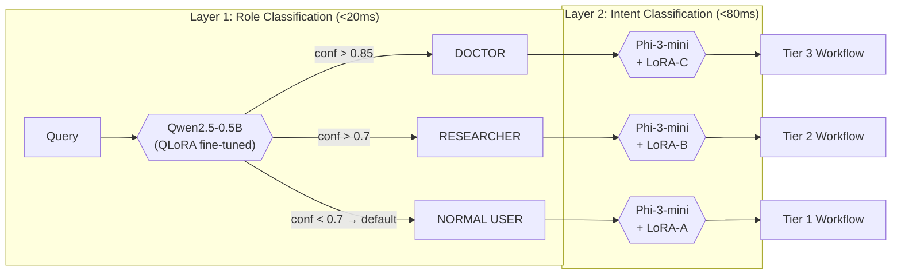

**Key design decisions:**
- **Why SLMs not LLMs for routing:** Latency (<50ms), cost (100K queries/day), determinism, privacy (on-device)
- **LoRA hot-swap:** Single Phi-3-mini base model (~2GB in 4-bit), 3 adapters (~20-50MB each), ~5ms swap time
- **Confidence thresholds:** <0.7 → default to NORMAL (safest); 0.7-0.85 → add safety disclaimers; >0.85 → full confidence

### 4.2 Emergency Fast-Path

Emergency keywords **bypass ALL normal workflows**:

| Language | Keywords |
|----------|----------|
| Vietnamese | co giật, ngừng thở, đau ngực dữ dội, xuất huyết, ngộ độc, tự tử |
| English | seizure, stop breathing, severe chest pain, bleeding heavily, poisoning, suicide |

**Response (<1 second):**
1. Display 115 (Vietnam emergency number)
2. Pre-cached first-aid guidance
3. Nearest hospital (if location available)
4. Log as critical event
5. **MUST NOT engage in diagnostic reasoning**

---

## 5. Layer 3: Core Agents & Workflow Router

### 5.1 Three Workflow Tiers

| Aspect | Tier 1 (Simple) | Tier 2 (Research) | Tier 3 (AI Council) |
|--------|-----------------|-------------------|---------------------|
| **User** | Normal users | Researchers | Doctors (verified) |
| **Time** | <2 minutes | 5-20 minutes | 10-20 minutes |
| **RAG** | Single-source | Multi-source progressive | Multi-specialist parallel |
| **Verification** | `quick_pattern_check()` | `standard_verification()` | `full_fides_verification()` |
| **Display** | Simple Vietnamese | Progressive streaming | Hội chẩn report + logs |
| **Sources** | BYT / Dược thư / RxNorm | PubMed + Trials + BYT + ... | All sources + specialty KBs |
| **Cache** | Heavy caching | Moderate caching | No caching (patient-specific) |

### 5.2 Agent Descriptions

**Medical Coding Agent (Tool Orchestrator):**
- NOT a code-generation agent — it "codes" the retrieval strategy
- Receives structured intent from router
- Determines which data sources/tools to call
- Generates API call parameters in correct format
- Orchestrates retrieval pipeline (sequential or parallel)

**Literature Agent:**
- Manages PubMed/PMC search strategy
- MeSH-enriched query construction
- Date prioritization (last 5 years weighted higher)
- Cross-reference with locally cached PubMed index

**Safety Agent:**
- Drug-drug interaction checking (RxNorm + DrugBank)
- Dosage calculation (patient-specific: renal, hepatic, weight, age)
- Contraindication detection against BYT protocols
- Drug normalization (Vietnamese drug names → generic → RxCUI)

**AI Council Orchestrator:**
- Spawns 2-5 specialist agents (Cardiology, Nephrology, etc.)
- Each analyzes independently with specialty LoRA adapters
- Conflict detection → structured debate → consensus/divergence
- Full FIDES pipeline on ALL claims
- BYT protocol compliance check

---

## 6. Layer 4: Smart Router & Knowledge Sources

### 6.1 Source Registry

| Source | Type | Access | Update Frequency | CLARA Use Case |
|--------|------|--------|-----------------|----------------|
| **PubMed/PMC** | Literature | E-Utils API | Real-time | Literature search, evidence retrieval |
| **ClinicalTrials.gov** | Clinical Trials | REST API v2 | Real-time | Trial matching, NCT verification |
| **WHO ICD-11** | Disease Coding | REST + OAuth2 | Annual (cached) | Condition mapping, disease hierarchy |
| **RxNorm** | Drug Data | REST API | Monthly (cached + API) | Drug normalization, DDI checks |
| **openFDA** | Drug Safety | REST API | Real-time | Adverse events, recalls, labeling |
| **Dược thư QG** | VN Drugs | Crawled/PDF | Annual edition | Vietnamese drug monographs |
| **BYT Protocols** | VN Guidelines | Crawled | Monthly | Treatment protocols, guidelines |
| **BYT Circulars** | VN Updates | Crawled | Weekly | Safety alerts, policy changes |
| **UMLS/SNOMED** | Ontology | Local DB | Biannual | Medical concept mapping |
| **Local KG** | Relations | Neo4j | Continuous | Medical knowledge graph |

### 6.2 Smart Routing Logic

The Decision Engine selects sources based on:
1. **Semantic relevance** — BGE-M3 embedding similarity between query and source descriptions
2. **Latency constraints** — Tier 1 uses fastest single source; Tier 2/3 use multiple sources in parallel
3. **Rate limit awareness** — Distributes requests to avoid API throttling
4. **Source freshness** — Prioritizes recently-updated sources for time-sensitive queries

---

## 7. Layer 5: RAG Pipeline (Detailed)

### 7.1 Retrieval Strategy

```
Stage 1: Initial Retrieval (Broad)
  └── Top-100 chunks per sub-query via hybrid search
      Hybrid Score = 0.6 × Dense(BGE-M3) + 0.4 × Sparse(BM25)

Stage 2: Cross-Encoder Reranking (Precision)
  ├── Model: BGE-Reranker-v2-m3
  ├── Medical domain boost factors:
  │   ├── +0.3 for clinical guidelines
  │   ├── +0.2 for systematic reviews / meta-analyses
  │   ├── +0.1 for Vietnamese-language sources
  │   ├── +0.15 for recency (< 2 years old)
  │   └── -0.2 for retracted papers / outdated guidelines
  └── Select top-20 chunks per sub-query

Stage 3: Diversity Filter
  ├── Min 1 guideline, 1 research article, 1 drug reference
  ├── De-duplicate (cosine similarity > 0.95)
  └── Max 40% from single source

Stage 4: Relevance Threshold
  └── Drop chunks with reranker score < 0.3
```

### 7.2 FIDES Verification — Tiered

| Severity | Examples | Action on Failure |
|----------|---------|-------------------|
| **CRITICAL** | Dosage, DDI, contraindication | `BLOCK_RESPONSE` |
| **HIGH** | Diagnosis, treatment recommendation | `FLAG_AND_WARN` |
| **MEDIUM** | Statistics, prevalence data | `ADD_UNCERTAINTY_NOTE` |
| **LOW** | General health info | `LOG_ONLY` |

**Drug dosage/interaction claims ALWAYS verify against structured DB** (Dược thư + RxNorm), never LLM-only.

**DDI verification requires ≥2 source confirmation:**
- Confirmed by ≥2 → `VERIFIED`
- 1 source → `PARTIALLY_VERIFIED`
- Severity mismatch → `CONTESTED`
- Not found → `UNSUPPORTED` → `BLOCK` if CRITICAL

---

## 8. Layer 6: Output, Audit & Blockchain

### 8.1 Response Delivery

| User Type | Delivery Method | Format |
|-----------|----------------|--------|
| Normal | SSE (Server-Sent Events) | Simple Vietnamese, clear actions |
| Researcher | WebSocket (Perplexity-style) | Progressive phases (2→5→10→20 min) |
| Doctor | WebSocket + Processing Logs | Hội chẩn report with specialist opinions |

### 8.2 Blockchain Audit Trail

**Hybrid architecture (★ RECOMMENDED):**
- **Hyperledger Fabric** (private): Detailed audit records, consent management
- **Polygon** (public): Weekly hash anchoring for public verifiability
- **Latency impact:** ~0ms (all writes are async, post-response)
- **Cost:** ~$250-620/month

### 8.3 4-Layer Cache (UPDATE not ADD)

| Layer | Storage | TTL | Key Pattern |
|-------|---------|-----|-------------|
| L1: Hot Cache | Redis | 24h (general), 6h (drugs), 1h (trials) | `clara:qr:{role}:{query_hash}` |
| L2: Knowledge Entity | PostgreSQL JSONB | 7 days | `{entity}:{context_type}` |
| L3: Embedding Cache | FAISS/Milvus | 30 days | Pre-computed embeddings |
| L4: Freshness Tracker | Custom | Continuous | Source update timestamps |

**Evidence priority hierarchy:** BYT Protocol > Clinical Guidelines > Meta-analysis > RCT > Dược thư > Observational > Expert opinion

---

## 9. Supplementary Diagrams

### 9.1 Two-Layer Intent Router Detail

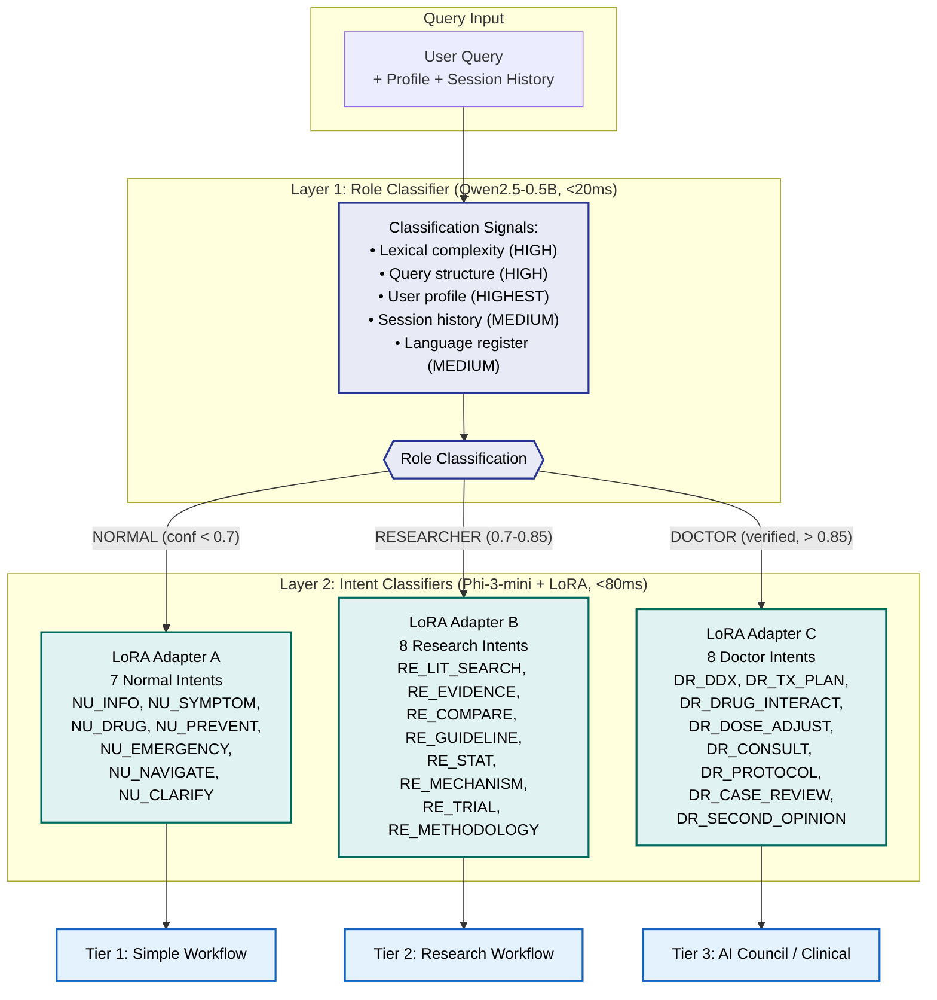

### 9.2 RAG Pipeline Detail

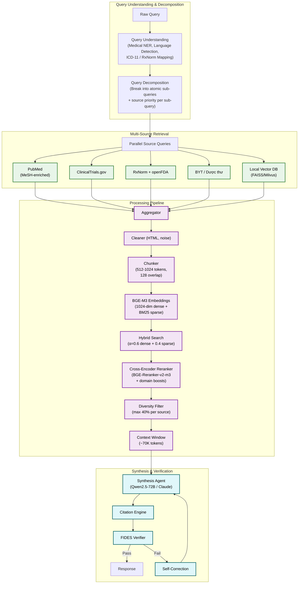


### 9.3 FIDES Fact-Checking Pipeline

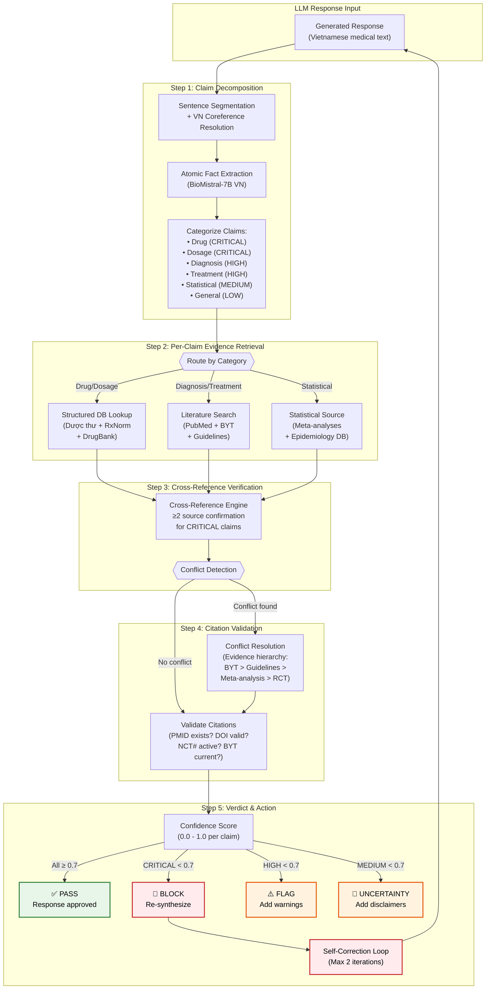


### 9.4 AI Council (Hội chẩn)

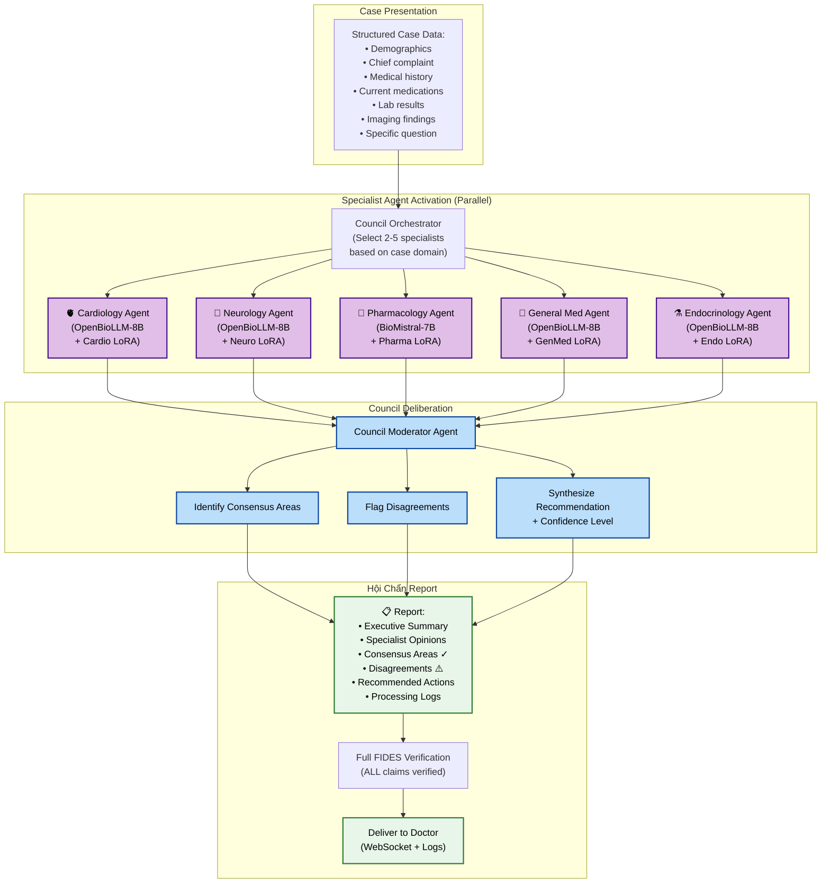

### 9.5 Cache Architecture

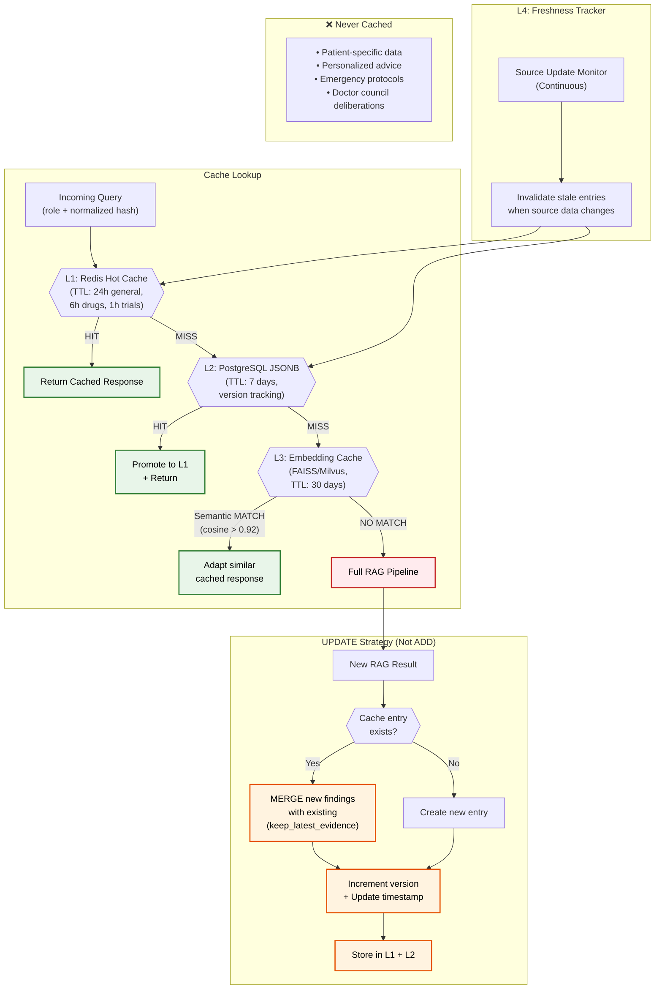


### 9.6 Vietnamese NLP Pipeline

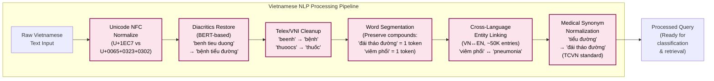

### 9.7 Doctor Workflow — Sub-Agent Architecture

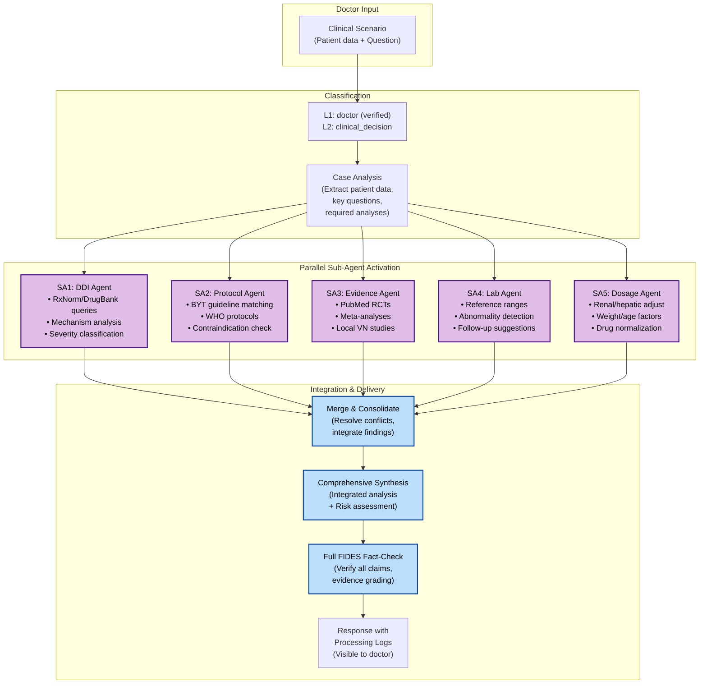


### 9.8 Research Workflow — Progressive Display

```mermaid
graph TD
    subgraph Input_R ["Research Query"]
        RQ_IN["Researcher Query<br/>(Complex topic)"] --> DECOMP["Query Decomposition<br/>(Break into sub-queries)"]
    end

    subgraph Phase1 ["Phase 1 (2 min)"]
        DECOMP --> PM_QUICK["PubMed Quick Search<br/>• Top 10 abstracts<br/>• Recent papers<br/>• High-impact only"]
        PM_QUICK --> SHOW1["📊 Show Phase 1<br/>(User can start reading)"]
    end

    subgraph Phase2 ["Phase 2 (5 min)"]
        SHOW1 -.-> CT_SEARCH["+ ClinicalTrials.gov<br/>+ RxNorm<br/>• Trial protocols<br/>• Drug interactions"]
        CT_SEARCH --> SHOW2["📊 Update to Phase 1+2<br/>(Expanded results)"]
    end

    subgraph Phase3 ["Phase 3 (10 min)"]
        SHOW2 -.-> VN_SEARCH["+ BYT Guidelines<br/>+ Dược thư QG<br/>• Local guidelines<br/>• Vietnamese studies"]
        VN_SEARCH --> SHOW3["📊 Show Phase 1+2+3<br/>(Nearly complete)"]
    end

    subgraph Phase4 ["Phase 4 (20 min — Optional)"]
        SHOW3 -.-> DEEP["Deep Analysis<br/>• Full-text retrieval<br/>• Meta-analysis<br/>• Citation network"]
        DEEP --> SYNTH_R["Synthesis Node<br/>(Aggregate, patterns,<br/>conflicts, evidence grade)"]
        SYNTH_R --> VERIFY_R["FIDES Verification<br/>(Full 5-step)"]
        VERIFY_R --> CACHE_R["Cache UPDATE<br/>(Merge new findings)"]
        CACHE_R --> SHOW4["📊 Final Results<br/>with Sources & Citations"]
    end

    classDef phase fill:#e3f2fd,stroke:#1565c0,stroke-width:2px,color:#000;
    classDef show fill:#e8f5e9,stroke:#2e7d32,stroke-width:2px,color:#000;
    class PM_QUICK,CT_SEARCH,VN_SEARCH,DEEP phase;
    class SHOW1,SHOW2,SHOW3,SHOW4 show;
```

### 9.9 Emergency Fast-Path

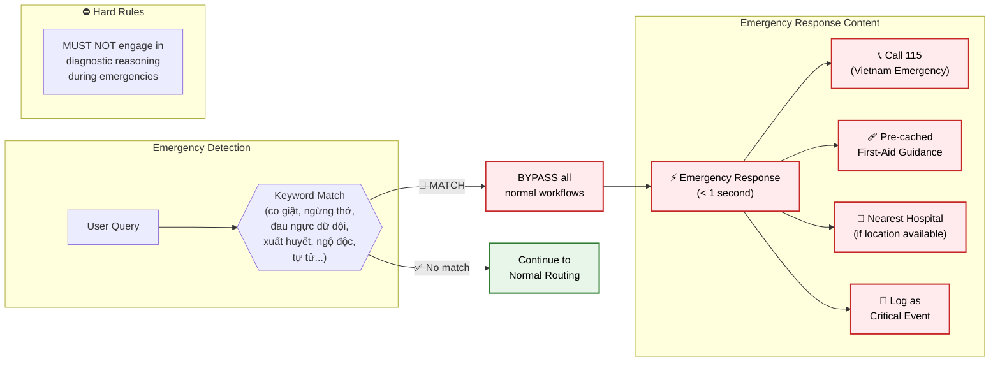

### 9.10 Drug Normalization Pipeline

```mermaid
graph LR
    subgraph DrugNorm ["Vietnamese Drug Normalization Pipeline"]
        VN_DRUG["Vietnamese Drug Name<br/>(e.g., 'Panadol',<br/>'thuốc hạ sốt')"] --> STEP1["Step 1:<br/>Local VN Lookup<br/>(Dược thư mapping)"]
        STEP1 --> GENERIC["Generic Name<br/>(e.g., 'acetaminophen'<br/>/ 'paracetamol')"]
        GENERIC --> STEP2["Step 2:<br/>RxNorm API<br/>/rxcui?name="]
        STEP2 --> RXCUI["RxCUI Identifier"]
        RXCUI --> STEP3["Step 3:<br/>Verify via<br/>/drugs?conceptId="]
        STEP3 --> STEP4["Step 4:<br/>Drug Class<br/>/rxclass/class/<br/>byDrugName"]
        STEP4 --> STEP5["Step 5:<br/>DDI Check<br/>/interaction/<br/>list?rxcuis="]
    end

    STEP5 --> RESULT["Normalized Drug Profile<br/>+ Interactions<br/>+ Drug Class"]

    classDef drug fill:#e1bee7,stroke:#4a148c,stroke-width:2px,color:#000;
    classDef verify fill:#fff3e0,stroke:#e65100,stroke-width:2px,color:#000;
    class VN_DRUG,STEP1,GENERIC drug;
    class STEP2,STEP3,STEP4,STEP5 verify;
```


### 9.11 Infrastructure & DevOps

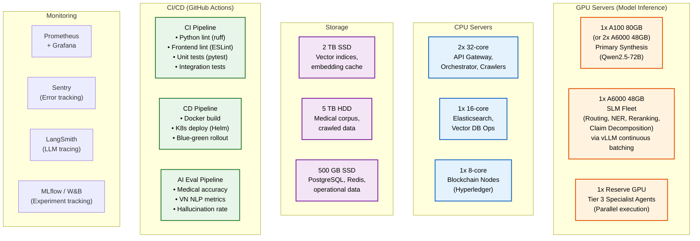


---

## 10. Technology Stack Reference

| Layer | Technologies |
|-------|-------------|
| **Frontend** | Next.js / React, TailwindCSS, WebSocket (streaming), PWA for mobile |
| **API Gateway** | Kong / Traefik, JWT Auth, Rate Limiting |
| **Backend Orchestrator** | Python (FastAPI), LangGraph / LangChain for agent orchestration |
| **SLM Inference** | vLLM / TGI (Text Generation Inference) for local model serving |
| **LLM API** | Claude API (Anthropic), OpenAI API (fallback) |
| **Vector Database** | FAISS (local) / Milvus (distributed) |
| **Search Engine** | Elasticsearch / OpenSearch (BM25 sparse) |
| **Graph Database** | Neo4j (medical knowledge graph) |
| **Primary Database** | PostgreSQL (with JSONB for structured data) |
| **Cache** | Redis (hot cache), PostgreSQL (warm cache) |
| **Message Queue** | RabbitMQ / Redis Streams (async processing) |
| **Web Crawler** | Scrapy + Playwright (BYT sources) |
| **Blockchain** | Hyperledger Fabric + Polygon (hybrid) |
| **Monitoring** | Prometheus + Grafana, Sentry (errors), LangSmith (LLM tracing) |
| **ML Experiment Tracking** | MLflow / Weights & Biases |
| **Container / Deploy** | Docker, Kubernetes (K8s), Helm charts |
| **GPU Infrastructure** | NVIDIA A100/H100 (inference), Cloud GPU (AWS/GCP) or on-premise |

---

## 11. Model Stack Reference

| Component | Model | Size | Latency |
|-----------|-------|------|---------|
| Role classifier (L1) | Qwen2.5-0.5B-Instruct (VN fine-tuned) | 0.5B | <20ms |
| Intent router (L2) | Qwen2.5-3B / Phi-3-mini + LoRA | 3B | <80ms |
| Medical NER | ViHealthBERT + Qwen2.5-1.5B ensemble | 110M+1.5B | <100ms |
| Response synthesis | Qwen2.5-72B / GPT-4o fallback | 72B | 2-10s |
| Fact-checking | BioMistral-7B (VN fine-tuned) | 7B | 1-5s |
| ASR | Whisper Large v3 (VN fine-tuned) | 1.5B | Real-time |
| Embeddings | BGE-M3 (multilingual) | 568M | <50ms |
| Cross-encoder reranker | BGE-Reranker-v2-m3 | — | <200ms |
| AI Council specialist | OpenBioLLM-8B / BioMistral-7B + specialty LoRA | 7-8B | 2-8s |
| Hybrid search α | 0.6 (dense-weighted) | — | — |


---

## 12. API Rate Limits & External Dependencies

| API | Rate Limit | Auth Required | CLARA Usage |
|-----|-----------|---------------|-------------|
| **PubMed (NCBI)** | 10 req/s with key, 3 req/s without | NCBI API Key | Literature search, evidence retrieval |
| **RxNorm (NLM)** | ~20 req/s | None | Drug normalization, DDI checks |
| **openFDA** | 240 req/min with key | Optional | Adverse events, drug safety |
| **ICD-11 (WHO)** | Standard | Client ID + Secret (OAuth2) | Disease coding, hierarchy |
| **ClinicalTrials.gov** | Standard | None | Trial matching, NCT verification |
| **Claude API** | Tier-dependent | API Key | Synthesis fallback (when local GPU unavailable) |

### Estimated Monthly Infrastructure Cost

| Component | Cost Range |
|-----------|-----------|
| GPU instances | $3,000 - $5,000 |
| CPU instances | $500 - $800 |
| Storage | $200 - $400 |
| API costs (Claude/OpenAI) | $500 - $2,000 (usage-dependent) |
| Blockchain infrastructure | $250 - $620 |
| Monitoring & misc | $200 - $300 |
| **TOTAL** | **~$4,650 - $9,120/month** |

---

## Cross-Reference Index

This document synthesizes architecture details from the following source documents:

| Document | Lines | Key Content |
|----------|-------|-------------|
| `CLAUDE.md` | 174 | Project config, model stack, API limits, critical design decisions |
| `docs/research/technical_architecture_deep_dive.md` | 2,008 | Core 7-dimension architecture specification |
| `docs/proposal/clara_workflows.md` | 958 | Workflow diagrams for all 3 tiers |
| `docs/research/data_sources_and_rag_analysis.md` | 1,581 | Data sources, RAG pipeline, cache strategy |
| `docs/research/fides_fact_checker.md` | 1,303 | FIDES verification pipeline |
| `docs/proposal/product_proposal.md` | 1,270 | Product specifications |
| `docs/proposal/project_structure_and_sprints.md` | 826 | Project structure, sprint planning |
| `docs/proposal/devops_and_cicd.md` | 2,795 | CI/CD, Docker, K8s, monitoring |

**Total source material:** ~15,721 lines across 14 documents → synthesized into this single architecture reference.

---

> **Document maintained by:** CLARA Engineering Team
> **Last updated:** January 2025
> **Next review:** After Sprint 1 completion
>
> *CLARA (Clinical Agent for Retrieval & Analysis) — Vietnamese Medical AI Assistant*
> *© 2025 CLARA Project — Internal Technical Documentation*