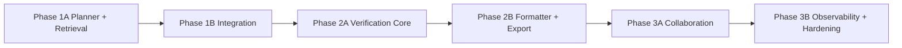

# Deep Research 2026: Benchmark + Implementation Plan cho CLARA

- Ngày cập nhật: 2026-04-02
- Phạm vi: benchmark theo thông tin public + plan triển khai thực dụng cho codebase CLARA hiện tại.
- Nguyên tắc dữ liệu: không dùng số benchmark nội bộ chưa đo. Các con số trong tài liệu này là **mục tiêu đo kiểm** để triển khai.

## 1) Benchmark sản phẩm tương tự theo 6 trục

### 1.1 So sánh năng lực (public signals)

| Trục | ChatGPT Deep Research | Gemini Deep Research | Perplexity (Research stack) | DeepSeek reasoning stack | Hàm ý cho CLARA |
|---|---|---|---|---|---|
| Query planning | Có bước đề xuất plan trước khi chạy, user review/edit plan, có thể chọn nguồn/scope site cụ thể. | Có bước tạo research plan, user edit rồi mới start. | Có cơ chế classifier tự quyết định `pro`/`fast` theo độ phức tạp truy vấn. | Mạnh ở thinking/reasoning, không phải sản phẩm planner full deep research out-of-box. | CLARA nên có plan có thể chỉnh tay + policy routing tự động theo query complexity. |
| Multi-pass retrieval | Multi-step research, chọn web/files/apps, có thể giới hạn trusted sites; có progress real-time và interrupt. | Iterative web browsing nhiều vòng, refine nhiều lần trước khi ra report; hỗ trợ chọn sources (web + Gmail/Drive). | Pro search hỗ trợ multi-step tool usage (`web_search`, `fetch_url_content`), auto route theo độ khó. | Hỗ trợ reasoning + tool calls nhiều vòng, cần app orchestration bên ngoài để thành deep research hoàn chỉnh. | CLARA cần loop retrieval có pass budget + source policy (internal/scientific/web) thay vì 1-pass. |
| Verification / contradiction handling | Report có citations/source links; nhấn mạnh khả năng verify lại thông tin. | Report có links nguồn; flow tạo report có thể review/cross-check qua Canvas. | Có transparency metadata cho mode routing; enterprise có audit log đầy đủ query/agent step/answer. | Có reasoning content và vòng tool-call; không có contradiction matrix product-level mặc định. | CLARA có thể vượt trội bằng claim-level verification matrix + contradiction severity gating. |
| Report formatting (table / mermaid / chart) | Report có cấu trúc, ToC, sources, activity history; hỗ trợ tải về nhiều format. | Có report + visual (chart/diagram/simulator) ở plan phù hợp; có custom visualization prompt. | Tập trung vào search/retrieval stack; docs public thiên về chế độ search và enterprise ops hơn UI formatter sâu. | API-level reasoning/tool output; formatter phụ thuộc app tích hợp. | CLARA nên chuẩn hóa report contract: section bắt buộc + bảng + mermaid + chart spec fence. |
| Export / share collaboration | Download report nhiều định dạng + quản trị enterprise (RBAC, compliance API). | Share Canvas + Export to Docs + copy nội dung. | Spaces hỗ trợ cộng tác viewer/research partner + connector enterprise + sharing control. | API/open model, collaboration/export do ứng dụng tự xây. | CLARA nên có export gốc (`md/docx/pdf`) + cơ chế review nội bộ theo thread. |
| Observability | Có progress live, activity history, và admin/compliance hooks. | Có trạng thái theo tiến trình report trong Canvas/chat history. | Có audit logs webhook, schema sự kiện rõ, insights dashboard enterprise. | Có telemetry ở mức API/thinking/tool-call, chưa có dashboard E2E mặc định. | CLARA cần trace/span theo stage, event stream, dashboard vận hành + replay run. |

### 1.2 Mục tiêu đo kiểm benchmark cho CLARA (không phải số liệu hiện tại)

| Trục | Mục tiêu đo kiểm | Cách đo |
|---|---|---|
| Query planning | Tỷ lệ query có plan có thể chỉnh sửa trước khi chạy | Log event `planner.proposed` + `planner.user_approved` |
| Multi-pass retrieval | Tỷ lệ phiên deep có >=2 retrieval pass khi query phức tạp | Stage span `multi_pass_retrieval` + số pass trong telemetry |
| Verification | Tỷ lệ câu trả lời deep có verification matrix + contradiction summary | Snapshot payload `verification_matrix`, `contradiction_summary` |
| Report formatting | Tỷ lệ report đúng schema section + parse được table/mermaid/chart spec | Contract test cho renderer + parser test |
| Export/collab | Tỷ lệ report export thành công + tỷ lệ share link truy cập hợp lệ | API metrics cho export/share endpoints |
| Observability | Tỷ lệ run có trace_id/run_id + đủ stage spans tối thiểu | Ingest pipeline kiểm tra completeness theo run |

## 2) Đề xuất điểm khác biệt “ĐỘC-LẠ” cho CLARA (implementable)

1. **Claim Contradiction Radar (CCR)**
- Ý tưởng: highlight claim nào bị evidence phản biện trực tiếp, gắn severity + khuyến nghị hành động y khoa.
- Triển khai: mở rộng `services/ml/src/clara_ml/factcheck/fides_lite.py` và hiển thị radar ở `apps/web/components/research/telemetry-details-panel.tsx`.

2. **Source Sovereignty Lens (SSL)**
- Ý tưởng: mỗi claim bắt buộc có “nguồn ưu tiên theo thẩm quyền” (Bộ Y tế VN, guideline quốc tế, trials).
- Triển khai: ranking rule trong `services/ml/src/clara_ml/rag/retrieval/external_gateway.py` + policy gate ở `services/ml/src/clara_ml/agents/research_tier2.py`.

3. **Dual-Track Answer (Clinical Safe + Analyst Deep)**
- Ý tưởng: xuất đồng thời 2 lớp kết quả: “safe concise” cho ra quyết định nhanh và “deep evidence pack” cho người phân tích.
- Triển khai: tách output block trong `services/ml/src/clara_ml/agents/research_tier2.py`, render ở `apps/web/components/research/markdown-answer.tsx`.

4. **Replayable Research Runbook**
- Ý tưởng: mỗi run tạo replay pack (plan + queries + source attempts + verification rows) để tái lập khi audit.
- Triển khai: lưu event/trace trong `services/api/src/clara_api/core/flow/event_stream_service.py`, expose qua `services/api/src/clara_api/api/v1/endpoints/research.py`.

5. **Evidence Graph Auto-Mermaid**
- Ý tưởng: auto sinh biểu đồ claim -> evidence -> verdict (Mermaid) để reviewer đọc nhanh mâu thuẫn.
- Triển khai: formatter ở `apps/web/lib/research.ts` + renderer ở `apps/web/components/research/markdown-answer.tsx`.

6. **Pass Budget Controller theo Risk Level**
- Ý tưởng: query low-risk chạy fast/deep nhẹ; query high-risk (đa thuốc/chống chỉ định) tự nâng pass budget + tăng verification depth.
- Triển khai: controller trong `services/ml/src/clara_ml/rag/pipeline.py` + cấu hình tại `services/ml/src/clara_ml/config.py`.

## 3) Detailed implementation plan (phase-based)

### 3.0 Checklist vận hành bắt buộc: làm theo từng nửa phase một lần

Áp dụng cho **mọi phase**:

- [ ] Chốt backlog cho **Nửa A** (không trộn hạng mục Nửa B).
- [ ] Hoàn tất coding + test Nửa A, demo nội bộ 1 lần.
- [ ] Đóng băng scope và ký duyệt gate giữa phase.
- [ ] Mở backlog **Nửa B**, thực hiện đúng 1 vòng.
- [ ] Regression + nghiệm thu phase.

### 3.1 Phase 1 - Planner + Multi-pass Retrieval Foundation

**Objective**
- Chuẩn hóa planning và retrieval nhiều vòng cho `deep`/`deep_beta`, có telemetry đủ để replay.

**Scope files**
- `services/ml/src/clara_ml/agents/research_tier2.py`
- `services/ml/src/clara_ml/rag/pipeline.py`
- `services/ml/src/clara_ml/rag/retrieval/external_gateway.py`
- `services/ml/src/clara_ml/main.py`
- `apps/web/lib/research.ts`
- `apps/web/components/research/flow-timeline-panel.tsx`
- `apps/web/components/research/telemetry-details-panel.tsx`
- `services/ml/tests/test_research_tier2_agent.py`
- `services/ml/tests/test_main_api.py`

**Step-by-step checklist**

Nửa A (foundation):
- [ ] Nâng `query_plan` schema: mục tiêu, decomposition, source constraints, pass budget.
- [ ] Tách retrieval thành pass rõ ràng: internal -> scientific -> web -> synthesis.
- [ ] Gắn `trace_id/run_id` + `stage_spans` cho từng pass.
- [ ] Bổ sung policy route cho query phức tạp/high-risk.

Gate giữa phase:
- [ ] Demo 3 case: query đơn giản, query đa nguồn, query high-risk.
- [ ] Xác nhận payload backward-compatible cho UI hiện tại.

Nửa B (integration):
- [ ] Expose telemetry mới qua API/UI (`searchPlan`, `sourceAttempts`, `stageSpans`).
- [ ] Thêm “pass budget summary” trong panel telemetry.
- [ ] Cập nhật test snapshot cho deep/deep_beta.

**Test plan**
- Unit:
  - `pytest services/ml/tests/test_research_tier2_agent.py -q`
  - `pytest services/ml/tests/test_main_api.py -q`
- Integration:
  - Gọi endpoint tier2 với 3 mode `fast/deep/deep_beta`, assert đủ event/stage.
- Contract:
  - Parse payload bằng `normalizeResearchTier2` không throw.

**Rollback plan**
- Feature flag tắt multi-pass mới, quay về planner/retrieval cũ theo config.
- Tắt expose field mới ở UI, fallback dùng field cũ (`flow_events`, `citations`).

**KPI acceptance criteria (mục tiêu đo kiểm)**
- Tỷ lệ run deep/deep_beta có `trace_id` và `stage_spans` đầy đủ đạt ngưỡng release.
- Tỷ lệ query phức tạp có >=2 retrieval pass cao hơn baseline Phase 0.
- Không tăng lỗi 5xx ở endpoint research sau rollout canary.

### 3.2 Phase 2 - Verification Matrix + Report Formatter + Export

**Objective**
- Nâng verification từ “có/không” sang “claim-level contradiction aware”, đồng thời chuẩn hóa report format để export ổn định.

**Scope files**
- `services/ml/src/clara_ml/factcheck/fides_lite.py`
- `services/ml/src/clara_ml/agents/research_tier2.py`
- `services/ml/src/clara_ml/prompts/templates/researcher.yaml`
- `apps/web/components/research/markdown-answer.tsx`
- `apps/web/lib/research.ts`
- `services/api/src/clara_api/api/v1/endpoints/research.py`
- `services/ml/tests/test_factcheck_module.py`
- `services/api/tests/test_research_conversations.py`

**Step-by-step checklist**

Nửa A (verification core):
- [ ] Mở rộng verification row: claim type, evidence strength, contradiction rationale.
- [ ] Thêm severity policy: `low/medium/high` và cảnh báo an toàn tương ứng.
- [ ] Chuẩn hóa contract `verification_matrix` + `contradiction_summary`.

Gate giữa phase:
- [ ] Chạy bộ test contradiction synthetic (ít nhất 1 bộ DDI và 1 bộ guideline).
- [ ] Review output với team chuyên môn để tránh false alarm quá mức.

Nửa B (formatter/export):
- [ ] Áp schema report bắt buộc (summary/detail/recommendation/sources).
- [ ] Bật render table + mermaid + `chart_spec` fence theo whitelist.
- [ ] Chuẩn hóa export `markdown/word/pdf` từ report finalized.

**Test plan**
- Unit:
  - `pytest services/ml/tests/test_factcheck_module.py -q`
- Integration:
  - End-to-end từ submit query -> report -> export 3 format.
- Golden tests:
  - Snapshot markdown cho 5 truy vấn mẫu (không được mất headings bắt buộc).

**Rollback plan**
- Tắt `verification_v2`, quay về verdict cũ.
- Disable mermaid/chart parsing nếu renderer lỗi, giữ plain markdown.
- Freeze export về 1 format an toàn (`markdown`) khi có sự cố converter.

**KPI acceptance criteria (mục tiêu đo kiểm)**
- Tỷ lệ report deep có đủ section bắt buộc đạt ngưỡng release.
- Tỷ lệ run có `verification_matrix` hợp lệ tăng rõ rệt so với Phase 1.
- Tỷ lệ export thành công 3 format đạt ngưỡng release nội bộ.

### 3.3 Phase 3 - Collaboration + Observability + Production Hardening

**Objective**
- Đưa deep research thành năng lực team-ready: share/review/audit/replay và giám sát vận hành theo thời gian thực.

**Scope files**
- `services/api/src/clara_api/db/models.py`
- `services/api/alembic/versions/*` (migration mới cho review/share/audit)
- `services/api/src/clara_api/api/v1/endpoints/research.py`
- `services/api/src/clara_api/core/flow/event_stream_service.py`
- `apps/web/app/research/deepdive/page.tsx`
- `apps/web/components/research/history-panel.tsx`
- `apps/web/components/research/telemetry-details-panel.tsx`
- `apps/web/components/admin/admin-observability-panel.tsx`
- `services/api/tests/test_research_conversations.py`

**Step-by-step checklist**

Nửa A (collaboration):
- [ ] Thêm cơ chế share report theo role (owner/reviewer/viewer).
- [ ] Thêm workflow “challenge claim” để reviewer tạo phản biện theo claim.
- [ ] Lưu resolution log (accepted/rejected/needs-source).

Gate giữa phase:
- [ ] Security review quyền truy cập và expiry link.
- [ ] Kiểm tra audit trail đầy đủ cho hành động share/review.

Nửa B (observability & hardening):
- [ ] Dashboard runtime: throughput, error budget, pass count distribution.
- [ ] Replay run theo `trace_id` để điều tra lỗi.
- [ ] Canary + rollback automation theo ngưỡng SLO.

**Test plan**
- API tests cho permission matrix (owner/reviewer/viewer).
- Load test endpoint tier2 và stream events.
- Chaos test: mất external source -> hệ thống vẫn trả fallback an toàn.

**Rollback plan**
- Tắt collaboration endpoints, giữ chế độ private-only.
- Tắt replay endpoint nếu lộ metadata nhạy cảm.
- Quay về dashboard snapshot nếu streaming telemetry quá tải.

**KPI acceptance criteria (mục tiêu đo kiểm)**
- Tỷ lệ report được review thành công (challenge resolved) đạt ngưỡng adoption.
- Mean time to investigate một run lỗi giảm so với trước Phase 3.
- Không phát sinh sự cố quyền truy cập trái phép trong giai đoạn canary.

## 4) Risk register và mitigation

| Risk ID | Rủi ro | Tác động | Dấu hiệu sớm | Mitigation thực thi |
|---|---|---|---|---|
| R1 | Multi-pass làm tăng latency quá mức | UX xấu, timeout | P95 tăng đột biến ở mode deep | Áp pass budget theo risk; cắt pass khi confidence đã đủ; cache query plan |
| R2 | False contradiction cao | Mất niềm tin người dùng | Tăng số cảnh báo nhưng reviewer reject nhiều | Tinh chỉnh threshold theo loại claim; thêm human-review gate cho `high` |
| R3 | Nguồn web kém chất lượng lấn át nguồn chuẩn | Sai khuyến nghị y khoa | Source diversity lệch về domain rác | Priority ranking theo trusted registry + domain allowlist |
| R4 | Export formatter vỡ với markdown phức tạp | Không chia sẻ được báo cáo | Tăng lỗi converter docx/pdf | Fallback plain markdown + contract test parser trước release |
| R5 | Rò rỉ dữ liệu qua share link | Rủi ro bảo mật/compliance | Truy cập link từ user không quyền | Signed URL + TTL ngắn + RBAC check server-side |
| R6 | Telemetry thiếu trường quan trọng nên replay thất bại | Điều tra sự cố khó | Run không có trace/span đầy đủ | Gate release bắt buộc trace completeness; reject payload thiếu khóa |
| R7 | Drift prompt làm giảm tính nhất quán report | KPI chất lượng giảm | Headings bắt buộc mất hoặc thiếu citation | Golden tests + schema validator trước khi persist |
| R8 | Phụ thuộc external APIs (PubMed, web) không ổn định | Tăng lỗi retrieval | Timeout/source error tăng theo giờ | Circuit breaker + retry policy + degraded mode có thông báo rõ |

## Tài liệu tham chiếu public (as-of 2026-04-02)

- OpenAI: https://openai.com/index/introducing-deep-research/
- OpenAI Help (Deep research in ChatGPT): https://help.openai.com/en/articles/10500283-deep-research-faq
- Gemini Help (Use Deep Research): https://support.google.com/gemini/answer/15719111
- Google Blog (Gemini Deep Research): https://blog.google/products/gemini/google-gemini-deep-research/
- Perplexity Docs (Pro Search Classifier): https://docs.perplexity.ai/docs/sonar/pro-search/classifier
- Perplexity Help (Spaces): https://www.perplexity.ai/help-center/en/articles/10352961-what-are-spaces
- Perplexity Help (Audit Logs): https://www.perplexity.ai/help-center/en/articles/11652747-audit-logs
- Perplexity Help (File Connectors): https://www.perplexity.ai/help-center/en/articles/10672063-introduction-to-file-connectors-for-enterprise-organizations
- DeepSeek API Docs (Thinking Mode): https://api-docs.deepseek.com/guides/thinking_mode
- DeepSeek API News (R1 release): https://api-docs.deepseek.com/news/news250120
- DeepSeek-R1 GitHub: https://github.com/deepseek-ai/DeepSeek-R1
