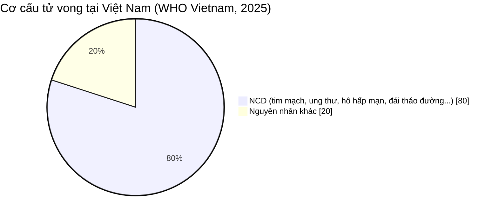
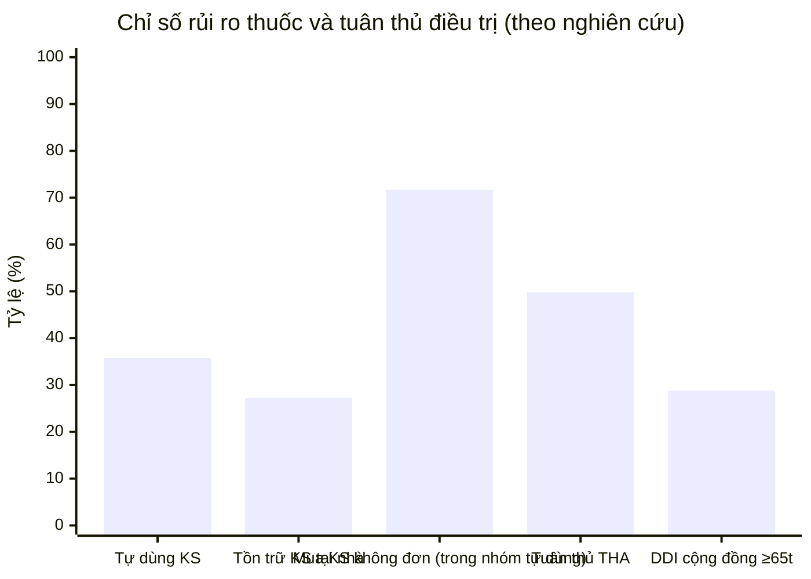
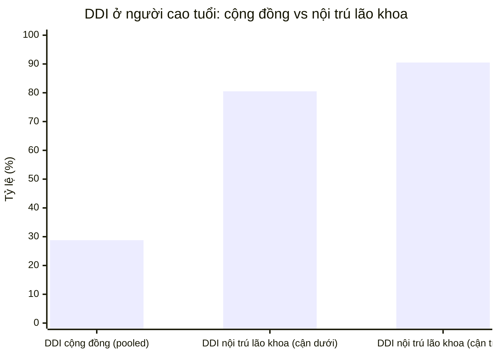
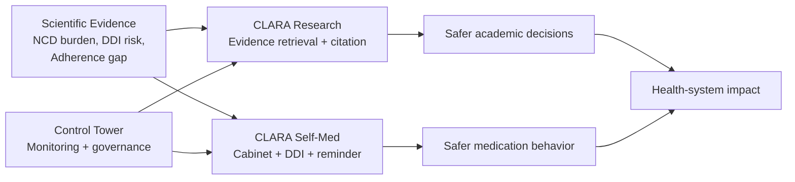
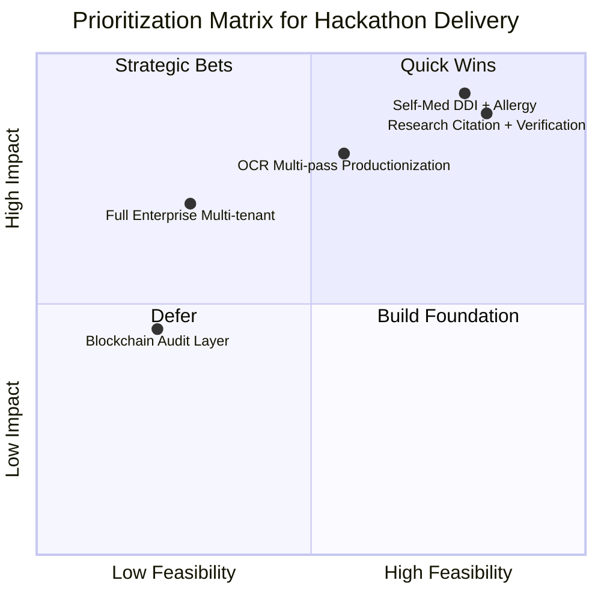
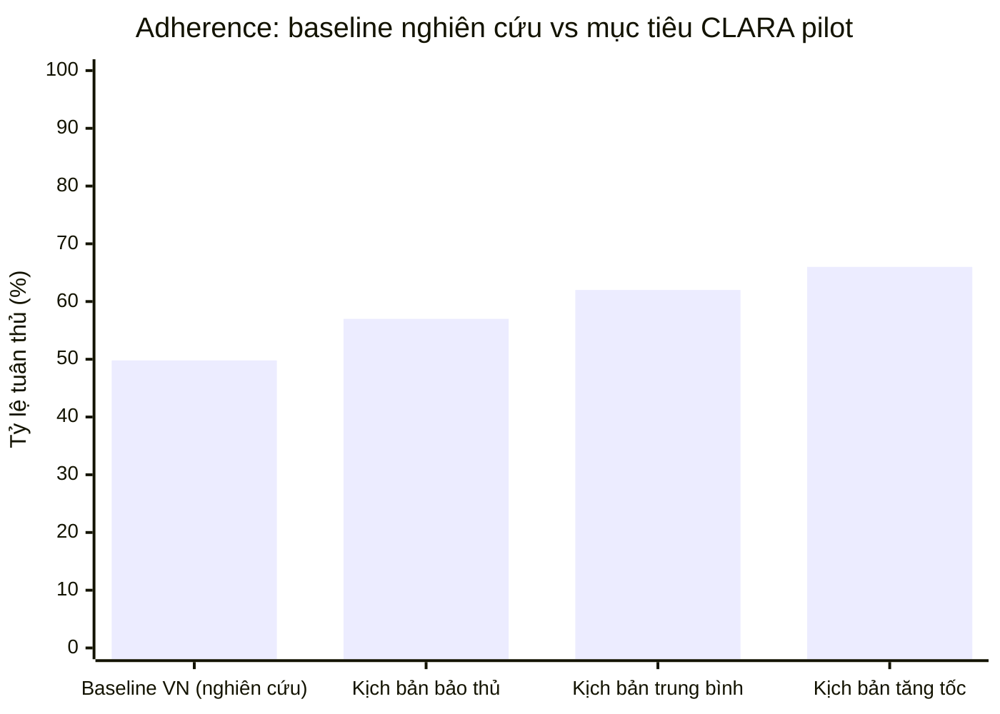
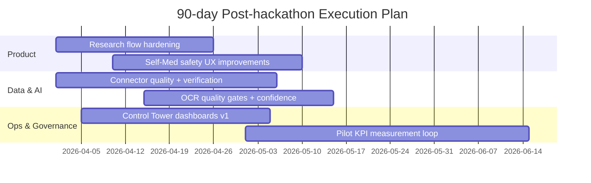

# ĐỀ XUẤT DỰ ÁN CLARA  
## Hệ sinh thái AI hỗ trợ nghiên cứu y học và an toàn dùng thuốc tại gia đình

Phiên bản: 1.0  
Ngày cập nhật: 2026-03-29  
Đơn vị đề xuất: CLARA Team

---

## MỤC LỤC

0. Tóm tắt Hackathon (Executive Pitch)  
1. Tổng quan  
2. Đặt vấn đề  
3. Các giải pháp hiện có  
4. Phạm vi và đối tượng  
5. Phạm vi sử dụng  
6. Mục tiêu dự án  
7. Ý tưởng dự án  
8. Mô tả sản phẩm  
9. Mô tả công nghệ dự kiến sử dụng  
10. Tính khả thi  
11. Hướng phát triển  
12. Phân công nhiệm vụ  
13. Tài liệu tham khảo

---

## 0. TÓM TẮT HACKATHON (EXECUTIVE PITCH)

### 0.1 Vấn đề lớn

Việt Nam đang đối mặt đồng thời hai áp lực:
- Gánh nặng bệnh mạn và NCD cao.
- Sai sót dùng thuốc trong cộng đồng do tự điều trị và quản lý thuốc tại nhà chưa chuẩn hóa.

Trong khi đó, nhóm nghiên cứu/bác sĩ trẻ đang thiếu công cụ truy xuất bằng chứng y khoa đủ nhanh, đủ tin cậy và đủ dễ kiểm chứng.

### 0.2 Giải pháp CLARA

CLARA là hệ sinh thái AI gồm 3 khối:
- `CLARA Research`: truy xuất bằng chứng y khoa đa nguồn, có citation và verification.
- `CLARA Self-Med`: quản lý tủ thuốc, cảnh báo DDI/dị ứng, nhắc liều, hướng dẫn an toàn.
- `CLARA Control Tower`: giám sát chất lượng, rủi ro và governance vận hành AI.

### 0.3 Điểm khác biệt để thắng hackathon

1. Không dừng ở chatbot: có kiến trúc `router -> retrieval -> synthesis -> verification -> policy`.  
2. Đã có codebase chạy thực tế (web + api + ml + mobile skeleton), không phải ý tưởng giấy.  
3. Có dữ liệu khoa học nền rõ ràng cho pain point và có lộ trình triển khai 30-60-90 ngày.  
4. Có mô hình “dual impact”: vừa hỗ trợ cộng đồng (Self-Med), vừa hỗ trợ học thuật/chuyên môn (Research).

### 0.4 Tuyên bố giá trị (Value Proposition)

- Với người dân: giảm rủi ro dùng thuốc sai và tăng tuân thủ điều trị.
- Với bác sĩ/sinh viên y: giảm thời gian truy xuất bằng chứng, tăng tính giải trình.
- Với tổ chức: có control-plane để mở rộng AI y tế theo hướng an toàn và kiểm toán được.

### 0.5 Mapping theo tiêu chí chấm hackathon

| Tiêu chí hackathon | CLARA đáp ứng như thế nào |
|---|---|
| Innovation | Agentic RAG + policy gate + medical safety workflows |
| Impact | Nhắm trực diện vào NCD burden, DDI risk, medication adherence |
| Feasibility | Đã có implementation core và infra chạy được |
| Scalability | Kiến trúc module, roadmap multi-tenant và governance |
| Demo readiness | Có luồng demo rõ cho Research + Self-Med + Dashboard |

### 0.6 Why CLARA can win

Từ góc nhìn ban giám khảo hackathon, CLARA có lợi thế ở 4 điểm:
- `Problem-depth`: không chọn pain point chung chung, mà bám đúng điểm đau có số liệu khoa học.
- `Build-depth`: có stack chạy được và có roadmap rõ từ demo đến pilot.
- `Safety-depth`: có verification/policy thay vì chỉ trả lời sinh ngôn ngữ tự do.
- `Scale-depth`: có module vận hành (Control Tower), phù hợp để mở rộng sau hackathon.

---

## 1. TỔNG QUAN

### 1.1 Bối cảnh

Việt Nam đang đi qua giai đoạn chuyển dịch mạnh về nhân khẩu học và gánh nặng bệnh tật. Mô hình bệnh đang nghiêng nhanh về nhóm bệnh không lây nhiễm, trong khi hệ thống y tế vẫn phải cùng lúc xử lý nhu cầu điều trị cấp tính, quản lý bệnh mạn và chăm sóc cộng đồng. Ở tầng người dân, nhu cầu tự chăm sóc sức khỏe tăng nhanh nhưng đi kèm với rủi ro dùng thuốc sai và tiếp nhận thông tin y tế không kiểm chứng.

Song song với đó, ở tầng học thuật và chuyên môn, đội ngũ sinh viên y khoa, bác sĩ trẻ và nhóm nghiên cứu đang phải xử lý khối lượng tài liệu lớn hơn trước nhiều lần. Việc truy xuất bằng chứng đáng tin cậy và tổng hợp có cấu trúc tiêu tốn đáng kể nguồn lực thời gian, đặc biệt khi cần đối chiếu đồng thời nguồn quốc tế và nguồn chuyên môn nội địa.

Trong bối cảnh đó, một nền tảng AI y tế không chỉ cần “trả lời nhanh” mà phải đáp ứng bốn yêu cầu cốt lõi:
- Truy xuất đúng nguồn và giải trình được.
- Giảm sai sót trong các quyết định liên quan dùng thuốc.
- Có cơ chế kiểm soát rủi ro, cảnh báo và chuyển tuyến an toàn.
- Phù hợp hành lang vận hành dữ liệu nhạy cảm trong môi trường y tế.

### 1.2 Tầm nhìn dự án

CLARA được định vị là một hệ sinh thái AI y tế đa mô-đun, gồm:
- `CLARA Research`: trợ lý nghiên cứu y khoa theo hướng bằng chứng.
- `CLARA Self-Med`: trợ lý an toàn dùng thuốc trong đời sống hằng ngày.
- `CLARA Medical Scribe`: chuyển hội thoại y khoa sang dữ liệu cấu trúc.
- `CLARA Control Tower`: lớp quản trị vận hành, chất lượng và tuân thủ.

Thay vì xây dựng một chatbot tổng quát, CLARA được thiết kế như một nền tảng “AI có kiểm soát”, trong đó luồng xử lý được tổ chức theo router vai trò, truy xuất đa nguồn, kiểm chứng độc lập và policy gate trước khi đưa khuyến nghị ra ngoài.

### 1.3 Cơ sở bằng chứng khoa học cho bài toán CLARA

Để tránh lập luận cảm tính, phần đặt vấn đề của CLARA được neo trên các kết quả nghiên cứu và báo cáo chính thức:

1. Gánh nặng bệnh không lây nhiễm tại Việt Nam đang ở mức rất cao. WHO Việt Nam (2025) ghi nhận NCD là nguyên nhân tử vong hàng đầu, chiếm khoảng 80% tổng số ca tử vong, trong đó có tỷ lệ lớn là tử vong sớm [S1].
2. Bệnh tim mạch là một thành phần trọng yếu của gánh nặng NCD. WHO Việt Nam ghi nhận CVD từng chiếm khoảng 31% tổng tử vong (mốc báo cáo 2016), đồng thời nhấn mạnh nhu cầu quản lý tăng huyết áp ở tuyến cơ sở [S2].
3. Tương tác thuốc ở người cao tuổi là rủi ro có thật và có quy mô đáng kể. Tổng quan hệ thống trên bệnh nhân cao tuổi nhập viện cho thấy tỷ lệ DDI dao động rất rộng, từ 8,34% đến 100%; riêng các đơn vị lão khoa dao động 80,5-90,5% [S3].
4. Ở cộng đồng, nguy cơ này vẫn cao. Meta-analysis trên người từ 65 tuổi sống tại cộng đồng (33 nghiên cứu, hơn 17 triệu đối tượng) ước tính tỷ lệ DDI gộp khoảng 28,8% [S4].
5. Bài toán tự dùng thuốc tại Việt Nam cũng được chứng minh bằng dữ liệu gần đây. Nghiên cứu cắt ngang đa tỉnh (2025) ghi nhận 35,8% người tham gia có tự dùng kháng sinh và 27,3% có lưu trữ kháng sinh tại nhà [S5].
6. Tuân thủ điều trị tăng huyết áp tại Việt Nam còn là thách thức. Nghiên cứu tại miền Bắc nông thôn ghi nhận mức tuân thủ 49,8% [S6]; nghiên cứu tại miền Trung (2025) cũng cho thấy chỉ khoảng một nửa bệnh nhân tuân thủ phác đồ [S7].
7. Về chiều ngược lại, bằng chứng can thiệp cho thấy có thể cải thiện tuân thủ thuốc nếu triển khai đúng chiến lược. Systematic review mới (2025) tổng hợp 128 nghiên cứu cho thấy đa số can thiệp cải thiện adherence, dù hiệu quả còn dị biệt theo ngữ cảnh và cường độ can thiệp [S8].
8. Bối cảnh nhân khẩu học củng cố thêm tính cấp thiết: chỉ số dân số từ 65 tuổi trở lên của Việt Nam cho thấy xu hướng tăng rõ rệt trong chuỗi WDI (1960-2024), hàm ý nhu cầu quản lý bệnh mạn và polypharmacy sẽ còn tăng [S9].

### 1.4 Biểu đồ dữ liệu thuyết phục

#### Biểu đồ 1: Gánh nặng tử vong do NCD tại Việt Nam

Nguồn: WHO Vietnam [S1].

#### Biểu đồ 2: Các tín hiệu rủi ro dùng thuốc nổi bật

Nguồn: [S4], [S5], [S6].

#### Biểu đồ 3: Mức độ lan rộng của DDI ở nhóm cao tuổi

Nguồn: [S3], [S4].

#### Bảng dữ liệu nhanh cho giám khảo

| Chỉ số | Giá trị | Ý nghĩa đối với CLARA | Nguồn |
|---|---:|---|---|
| Tử vong do NCD tại Việt Nam | ~80% | Xác nhận bài toán ưu tiên quốc gia | [S1] |
| CVD trong tổng tử vong tại Việt Nam (mốc 2016) | 31% | Trọng tâm cho module medication safety | [S2] |
| Tự dùng kháng sinh (VN, 2025) | 35,8% | Nhu cầu hướng dẫn dùng thuốc an toàn | [S5] |
| Tồn trữ kháng sinh tại nhà (VN, 2025) | 27,3% | Nhu cầu quản lý tủ thuốc và kiểm kê | [S5] |
| Mua kháng sinh không đơn trong nhóm tự dùng | 71,7% | Cần cảnh báo sớm và health literacy | [S5] |
| Tuân thủ thuốc tăng huyết áp (rural VN) | 49,8% | Cần reminder/escalation | [S6] |
| DDI pooled ở người ≥65 sống tại cộng đồng | 28,8% | Nhu cầu DDI-safe checker | [S4] |
| DDI ở đơn vị lão khoa nội trú | 80,5-90,5% | Nhấn mạnh mức rủi ro cao của polypharmacy | [S3] |

#### Biểu đồ 4: Kiến trúc giá trị từ dữ liệu đến tác động

Ý nghĩa: CLARA không chỉ có tính năng rời rạc, mà có chuỗi tác động khép kín từ bằng chứng khoa học đến kết quả vận hành.

#### Biểu đồ 5: Mức ưu tiên triển khai theo “Impact x Feasibility”

Ghi chú: đây là ma trận ưu tiên sản phẩm/phát triển nội bộ cho hackathon, không phải số liệu dịch tễ.

---

## 2. ĐẶT VẤN ĐỀ

### 2.1 Khoảng trống an toàn thông tin y tế trong tình huống khẩn cấp

Trong thực tế cộng đồng, nhiều tình huống cấp cứu diễn ra khi người bệnh không thể chủ động cung cấp thông tin. Đội ngũ hỗ trợ tại hiện trường hoặc cơ sở y tế tuyến đầu thường thiếu dữ liệu nền về:
- Dị ứng thuốc.
- Bệnh nền đang điều trị.
- Thuốc đang sử dụng.
- Lịch sử tương tác thuốc quan trọng gần đây.

Khoảng trống này làm tăng thời gian xử trí và làm giảm chất lượng quyết định ban đầu. Vấn đề không chỉ nằm ở thiếu dữ liệu mà còn ở thiếu một cơ chế chuẩn để truy xuất nhanh dữ liệu có thể tin cậy được.

### 2.2 Rủi ro trong quản lý tủ thuốc và tuân thủ điều trị tại nhà

Tại hộ gia đình, đặc biệt với người bệnh mạn tính hoặc người cao tuổi, các lỗi dùng thuốc phổ biến gồm:
- Quên liều hoặc trễ liều.
- Dùng trùng hoạt chất qua nhiều biệt dược.
- Dùng đồng thời các thuốc có tương tác nguy hiểm.
- Lưu giữ thuốc quá hạn, bảo quản sai điều kiện.

Phần lớn các lỗi này không phát sinh từ thiếu thiện chí, mà đến từ việc thiếu một hệ thống hỗ trợ quyết định đơn giản, liên tục, theo ngữ cảnh từng người dùng.

Các số liệu nghiên cứu gần đây cho thấy đây không phải rủi ro cá biệt:
- Tự dùng kháng sinh và lưu trữ kháng sinh tại nhà vẫn phổ biến trong cộng đồng Việt Nam [S5].
- Tuân thủ điều trị tăng huyết áp ở tuyến cơ sở chỉ đạt mức trung bình, dao động quanh ngưỡng một nửa bệnh nhân [S6], [S7].
- Với nhóm cao tuổi dùng nhiều thuốc, xác suất gặp tương tác thuốc ở mức đáng lưu ý cả trong bệnh viện và ngoài cộng đồng [S3], [S4].

### 2.3 Quá tải tri thức và chi phí tra cứu y học ở môi trường học thuật

Với nhóm nghiên cứu và đào tạo, vấn đề không phải thiếu tài liệu mà là:
- Quá nhiều nguồn và chất lượng nguồn không đồng đều.
- Khó duy trì truy vết từ kết luận về bằng chứng gốc.
- Tốn thời gian tổng hợp đa nguồn khi câu hỏi phức tạp.

Khi khối lượng truy vấn tăng, cần một công cụ vừa tăng tốc tổng hợp vừa giữ kỷ luật học thuật: có citation, có kiểm chứng, có cảnh báo khi bằng chứng chưa đủ.

### 2.4 Bài toán tuân thủ dữ liệu nhạy cảm trong hệ AI y tế

CLARA xử lý các tín hiệu dữ liệu có thể liên quan trực tiếp đến thông tin sức khỏe cá nhân. Vì vậy, bài toán kỹ thuật bắt buộc phải đi kèm bài toán governance:
- Giảm thiểu dữ liệu nhạy cảm ngay tại ingress.
- Ghi vết đầy đủ các quyết định AI quan trọng.
- Kiểm soát chặt luồng truy cập theo vai trò.
- Có cơ chế chứng minh tuân thủ khi kiểm toán vận hành.

---

## 3. CÁC GIẢI PHÁP HIỆN CÓ

### 3.1 Nhóm nền tảng hồ sơ sức khỏe cá nhân

Các nền tảng hồ sơ sức khỏe trong hệ sinh thái thiết bị lớn đã chứng minh một hướng đi quan trọng: tập trung dữ liệu cá nhân vào một nơi để tăng khả năng theo dõi và chia sẻ. Điểm mạnh của nhóm này là UX quen thuộc, tích hợp hệ thiết bị và độ phủ người dùng cao.

Hạn chế thường gặp:
- Khả năng lý giải y khoa chuyên sâu còn giới hạn.
- Chưa tối ưu cho bối cảnh dữ liệu tiếng Việt và nguồn nội địa.
- Không phải nền tảng nào cũng có cơ chế kiểm chứng bằng chứng theo chuẩn nghiên cứu.

### 3.2 Nhóm ứng dụng quản lý thuốc và nhắc lịch

Các ứng dụng quản lý thuốc quốc tế cho thấy nhu cầu thị trường rõ ràng:
- Nhắc liều có tác động trực tiếp tới tuân thủ điều trị.
- Mô hình chia sẻ với người chăm sóc giúp giảm rủi ro bỏ liều.
- Một số sản phẩm đã tích hợp kiểm tra tương tác thuốc ở mức thực dụng.

Khoảng trống còn mở:
- Chưa có chuẩn hóa đồng thời theo dữ liệu nội địa và chuẩn quốc tế.
- Chưa thống nhất luồng OCR/barcode có độ tin cậy cao cho thị trường đa biệt dược.
- Chưa kết nối sâu với mô hình truy xuất bằng chứng để giải thích nguy cơ theo ngôn ngữ dễ hiểu.

### 3.3 Nhóm AI search/research assistant

Các sản phẩm AI nghiên cứu hiện đại đã thiết lập chuẩn trải nghiệm mới:
- Quy trình nghiên cứu nhiều bước.
- Trích dẫn nguồn rõ ràng.
- Luồng làm rõ câu hỏi và theo dõi tiến độ.

Tuy nhiên, với miền y tế, chỉ citation là chưa đủ. Cần thêm lớp kiểm soát:
- Xác thực claim với nguồn y khoa trọng số cao.
- Cơ chế policy để chặn/giảm cấp khuyến nghị trong tình huống rủi ro.
- Truy vết quyết định ở mức phù hợp cho audit.

### 3.4 Kết luận benchmarking

Nghiên cứu đối sánh cho thấy CLARA có cơ hội cạnh tranh khi kết hợp ba năng lực trong một kiến trúc thống nhất:
- Trải nghiệm người dùng của trợ lý AI hiện đại.
- Kỷ luật bằng chứng của hệ thống nghiên cứu y học.
- Cơ chế an toàn dùng thuốc theo bối cảnh gia đình Việt Nam.

---

## 4. PHẠM VI VÀ ĐỐI TƯỢNG

### 4.1 Đối tượng chính

### 4.1.1 Người bệnh và người chăm sóc
- Người bệnh mạn tính cần dùng nhiều thuốc song song.
- Người cao tuổi cần hỗ trợ nhắc lịch, kiểm tra tương tác, theo dõi tuân thủ.
- Người chăm sóc cần dashboard theo dõi tập trung và cơ chế cảnh báo.

### 4.1.2 Bác sĩ, sinh viên y khoa, nhà nghiên cứu
- Nhóm cần truy xuất nhanh bằng chứng từ nhiều nguồn.
- Nhóm cần hỗ trợ tổng hợp guideline, phân tích xung đột nguồn.
- Nhóm cần công cụ scribe có cấu trúc để giảm tải thao tác hành chính.

### 4.1.3 Nhóm vận hành hệ thống
- Product/Ops/Clinical/Security sử dụng Control Tower để theo dõi chất lượng, rủi ro và tuân thủ.

### 4.2 Phạm vi chức năng

Trong giai đoạn triển khai theo roadmap hiện tại, dự án bao phủ:
- Chat y khoa có định tuyến role/intent.
- Truy xuất đa nguồn cho nghiên cứu.
- Quản lý tủ thuốc, scan thuốc, DDI check, allergy alerts, reminder cơ bản.
- Scribe SOAP cơ bản.
- Dashboard vận hành và cấu hình nguồn RAG.

### 4.3 Ngoài phạm vi

Ở giai đoạn này, CLARA không thay thế:
- Khám/chẩn đoán lâm sàng trực tiếp.
- Kê đơn tự động không có kiểm soát của chuyên gia.
- Các quyết định y khoa hard-stop dựa thuần vào LLM mà không có rule/policy gate.

---

## 5. PHẠM VI SỬ DỤNG

CLARA được định vị theo nguyên tắc “hỗ trợ quyết định dựa trên bằng chứng”, ưu tiên cho:
- Giáo dục và đào tạo y khoa.
- Nghiên cứu học thuật.
- Nâng cao an toàn dùng thuốc ở cộng đồng.

Với nhóm người dân, hệ thống cung cấp hướng dẫn an toàn, không thay thế đánh giá chuyên môn khi có tình huống nguy cơ cao.  
Với nhóm chuyên môn, hệ thống hỗ trợ rút ngắn thời gian truy xuất và tổng hợp tài liệu, nhưng quyền quyết định cuối vẫn thuộc chuyên gia.

---

## 6. MỤC TIÊU DỰ ÁN

### 6.1 Mục tiêu tổng quát

Xây dựng hệ sinh thái AI y tế tích hợp, dựa trên tri thức chuẩn hóa và cơ chế kiểm chứng nhiều lớp, nhằm:
- Nâng cao an toàn sức khỏe cộng đồng.
- Nâng chất lượng hỗ trợ nghiên cứu và đào tạo y khoa.
- Hình thành nền tảng công nghệ có thể mở rộng ở cấp tổ chức.

### 6.2 Mục tiêu cụ thể theo trụ cột

### 6.2.1 Trụ cột Research
- Giảm thời gian từ câu hỏi đến insight có thể sử dụng.
- Tăng độ bao phủ citation và khả năng truy vết bằng chứng.
- Chuẩn hóa output theo định dạng dễ audit và dễ tái sử dụng.

### 6.2.2 Trụ cột Self-Med
- Giảm rủi ro tương tác thuốc có ý nghĩa lâm sàng.
- Cải thiện mức tuân thủ liều dùng theo thời gian.
- Giảm rủi ro sử dụng thuốc quá hạn hoặc bảo quản sai.

### 6.2.3 Trụ cột Scribe
- Chuẩn hóa dữ liệu hội thoại sang cấu trúc y khoa.
- Giảm tải ghi chép thủ công cho nhân sự y tế.

### 6.2.4 Trụ cột Governance
- Giám sát chất lượng và sự cố theo thời gian thực.
- Quản lý release model/prompt/policy có gate và rollback.
- Bảo đảm auditability cho các phản hồi rủi ro cao.

### 6.3 Hệ chỉ số mục tiêu

Nhóm chỉ số chính:
- Chỉ số hiệu năng: latency theo role/workflow.
- Chỉ số chất lượng tri thức: citation coverage, verification pass rate.
- Chỉ số an toàn Self-Med: DDI critical detection, alert handling SLA.
- Chỉ số vận hành: availability, incident response, MTTR.
- Chỉ số tuân thủ: audit completeness cho phiên rủi ro cao.

---

## 7. Ý TƯỞNG DỰ ÁN

### 7.1 Định nghĩa ý tưởng cốt lõi

CLARA được thiết kế như một `Multi-Agent AI System` theo kiến trúc `Agentic RAG`:
- AI không chỉ sinh câu trả lời.
- AI phải chọn nguồn phù hợp theo vai trò và mục đích truy vấn.
- AI phải qua lớp verification và policy trước khi phản hồi.

Ý tưởng trung tâm là chuyển từ “chatbot trả lời” sang “hệ điều hành tri thức y tế có kiểm soát”.

### 7.2 Lý do chọn kiến trúc hai nhánh sản phẩm

Thay vì xây rời rạc, CLARA dùng một lõi tri thức chung cho hai nhánh:
- Nhánh Research tạo năng lực kiểm chứng và chuẩn hóa tri thức.
- Nhánh Self-Med đưa tri thức đó vào kịch bản đời sống có ràng buộc an toàn.

Hai nhánh bổ trợ nhau:
- Research tăng chất lượng giải thích cho Self-Med.
- Self-Med tạo dữ liệu vận hành thực tế để cải tiến policy và ưu tiên nghiên cứu.

### 7.3 Vai trò của Control Tower

Control Tower là điểm khác biệt vận hành:
- Không chỉ hiển thị dashboard.
- Là lớp điều phối release, cảnh báo, incident, audit và governance.
- Là điều kiện bắt buộc để mở rộng hệ AI y tế ở quy mô lớn.

---

## 8. MÔ TẢ SẢN PHẨM

## 8.1 CLARA Research

### 8.1.1 Năng lực chính
- Truy xuất literature từ nhiều nguồn chuẩn.
- Tổng hợp theo câu hỏi nghiên cứu.
- Đối chiếu nguồn và nêu xung đột bằng chứng.
- Trả lời theo cấu trúc có citation.

### 8.1.2 Luồng xử lý chuẩn
1. Nhận truy vấn và role hint.
2. Router xác định intent.
3. Retrieval đa nguồn theo ngưỡng context.
4. Synthesis câu trả lời dự thảo.
5. Verification (FIDES-lite/strict mode theo lộ trình).
6. Policy quyết định allow/warn/escalate.
7. Trả lời kèm metadata kiểm chứng.

### 8.1.3 Giá trị cho người dùng học thuật
- Tăng tốc đọc hiểu tài liệu.
- Giảm rủi ro bỏ sót nguồn quan trọng.
- Dễ kiểm tra lại luận điểm vì có đường dẫn chứng cứ rõ.

## 8.2 CLARA Self-Med

### 8.2.1 Năng lực chính
- Quản lý tủ thuốc cá nhân/gia đình.
- Nhập liệu thủ công hoặc scan file.
- Phát hiện DDI và allergy conflict.
- Nhắc lịch dùng thuốc, cảnh báo trễ liều.

### 8.2.2 Luồng scan và chuẩn hóa
1. Người dùng upload file ảnh/PDF liên quan thuốc.
2. OCR adapter gọi dịch vụ nhận diện văn bản.
3. Hệ thống trích xuất tên thuốc và chuẩn hóa.
4. Mapping hoạt chất/phân loại nội bộ.
5. DDI check với local rules + external evidence.
6. Trả kết quả cảnh báo theo mức độ, kèm giải thích hành động tiếp theo.

### 8.2.3 Giá trị cho cộng đồng
- Giảm sai sót dùng thuốc thường gặp.
- Hỗ trợ người chăm sóc theo dõi nhiều thành viên.
- Giảm gánh nặng tâm lý khi phải tự giám sát điều trị hằng ngày.

## 8.3 CLARA Medical Scribe

### 8.3.1 Vai trò
- Chuyển hội thoại y khoa tự nhiên thành cấu trúc dữ liệu phục vụ hồ sơ.
- Tăng tính nhất quán trong ghi chép.
- Rút ngắn thời gian thao tác sau buổi khám/hội chẩn.

### 8.3.2 Trạng thái hiện tại
- Đã có endpoint `/v1/scribe/soap`.
- Nền tảng đang ở mức baseline, phù hợp để mở rộng theo template chuyên khoa ở phase tiếp theo.

## 8.4 CLARA Control Tower

### 8.4.1 Chức năng hiện có
- Quản trị config nguồn RAG và rag-flow.
- Theo dõi dependency health và metrics API.
- Cung cấp dữ liệu nền cho dashboard bác sĩ/quản trị.

### 8.4.2 Chức năng mở rộng theo roadmap
- Release governance cho model/prompt/policy.
- Incident center và runbook linkage.
- Audit explorer, compliance reports, cost governance.

---

## 9. MÔ TẢ CÔNG NGHỆ DỰ KIẾN SỬ DỤNG

## 9.1 Kiến trúc công nghệ tổng thể

CLARA sử dụng kiến trúc nhiều lớp:
- Presentation layer: Web (Next.js) + Mobile (Flutter).
- Service layer: API service và ML service tách riêng.
- Intelligence layer: routing, retrieval, synthesis, verification, policy.
- Data layer: relational DB + cache + vector/search/graph stores.
- Ops layer: observability, CI gates, Dockerized environments.

## 9.2 Công nghệ AI và NLP

### 9.2.1 Agentic RAG
- Retrieval-Augmented Generation làm xương sống.
- Kết hợp internal corpus và external scientific connectors.
- Có low-context threshold để kích hoạt retrieval phù hợp.

### 9.2.2 Orchestration
- LangChain cho prompt templates, retriever/tool bindings.
- LangGraph cho workflow graph và multi-step execution.

### 9.2.3 Router và fact-check
- Router phân loại role/intent với emergency fast-path.
- Fact-check module FIDES-lite đánh giá hỗ trợ claim theo evidence.

### 9.2.4 LLM/SLM strategy
- Hiện tại có tích hợp DeepSeek cho generation.
- Roadmap đánh giá thêm các dòng SLM/LLM theo phân vai tác vụ.
- Rule deterministic luôn ưu tiên cho quyết định safety-critical.

### 9.2.5 OCR và multimodal pipeline
- Giai đoạn hiện tại: OCR qua tgc-transhub adapter.
- Giai đoạn tiếp theo: chiến lược đa nhà cung cấp OCR (GCP/AWS/Azure) và quality gates theo confidence.

## 9.3 Lưu trữ và quản trị dữ liệu

### 9.3.1 Data stores hiện có
- PostgreSQL cho giao dịch.
- Redis cho cache/rate-limit primitives.
- Milvus cho vector retrieval.
- Elasticsearch cho search.
- Neo4j cho graph modeling.
- MinIO + etcd phục vụ stack Milvus.

### 9.3.2 Chuẩn trao đổi dữ liệu
- JSON là payload chính giữa các dịch vụ.
- Hướng mở rộng XML/structured export cho tích hợp nghiệp vụ đặc thù.

### 9.3.3 Nguồn tri thức kết nối
- PubMed, Europe PMC, OpenAlex, Crossref, ClinicalTrials.
- RxNav/RxNorm, openFDA, DailyMed.
- Nguồn nội địa và cổng thông tin y tế trong kế hoạch tích hợp mở rộng.

## 9.4 Bảo mật, an toàn và kiểm toán

### 9.4.1 Cơ chế hiện có
- JWT access/refresh, RBAC theo role.
- Redaction dữ liệu nhạy cảm ở ingress (phone/id/email).
- Middleware rate limit.
- Policy-driven fail-soft cho ML service outage.

### 9.4.2 Cơ chế roadmap
- Tăng cường consent management và audit explorer.
- Governance release model/prompt/policy.
- Chuẩn hóa compliance evidence export.

### 9.4.3 Vai trò của blockchain
- Tài liệu kiến trúc đề xuất chưa áp dụng blockchain ở phase đầu.
- Giai đoạn đầu ưu tiên append-only audit log.
- Blockchain có thể được đánh giá ở phase muộn nếu xuất hiện yêu cầu non-repudiation liên tổ chức.

## 9.5 Hạ tầng triển khai và DevOps

### 9.5.1 Hạ tầng local/app stack
- Docker Compose cho infra và app stack tách lớp.
- Nginx reverse proxy cho route web/api/ml.

### 9.5.2 Chất lượng phần mềm
- CI GitHub Actions với Ruff, mypy, pytest.
- Pre-commit hooks cho chất lượng trước push.
- Mô hình kiểm thử theo module API/ML và contract behavior.

---

## 10. TÍNH KHẢ THI

## 10.1 Tính khả thi kỹ thuật

CLARA có lợi thế kỹ thuật rõ ràng vì:
- Đã có implementation chạy được cho web/api/ml và các endpoint chính.
- Đã có integration với nhóm nguồn dữ liệu y khoa quan trọng.
- Đã có kiến trúc middleware cho auth/rate-limit/metrics.
- Đã có logic DDI, router, fact-check ở mức vận hành ban đầu.

Điều này giúp giảm đáng kể rủi ro “proposal chỉ dừng ở ý tưởng”.

## 10.2 Tính khả thi dữ liệu và tích hợp

Nguồn dữ liệu được thiết kế theo hai lớp:
- Lớp public/official có thể triển khai sớm.
- Lớp premium/compliance-heavy triển khai theo pha sau.

Cách tiếp cận này phù hợp thực tế vì vừa bảo đảm tiến độ, vừa giữ khả năng nâng cấp chất lượng dữ liệu theo thời gian.

## 10.3 Tính khả thi vận hành

Hệ thống đã có nền observability và control endpoints, tạo điều kiện để:
- Theo dõi chất lượng theo thời gian thực.
- Quản lý rủi ro khi phụ thuộc service ngoài.
- Triển khai fail-soft và degrade mode có kiểm soát.

Khi mở rộng quy mô, Control Tower sẽ là trục chính để giữ ổn định vận hành.

## 10.4 Tính khả thi pháp lý và đạo đức

Định hướng kiến trúc phù hợp nguyên tắc bảo vệ dữ liệu:
- Thu hẹp dữ liệu nhạy cảm từ đầu vào.
- Hạn chế vai trò AI trong quyết định hard-stop.
- Giữ quyền quyết định chuyên môn ở người hành nghề.

Đây là nền tảng quan trọng để tiến tới chuẩn hóa compliance với yêu cầu nội địa.

## 10.5 Ma trận rủi ro chính và phương án giảm thiểu

| Rủi ro | Tác động | Giảm thiểu |
|---|---|---|
| Bỏ sót DDI quan trọng | Ảnh hưởng an toàn người dùng | Rule-based checks + external evidence + policy severity |
| OCR nhận diện sai thuốc | Sai cảnh báo và sai nhắc lịch | Confidence threshold + user confirmation + fallback flow |
| Hallucination ở câu trả lời y khoa | Giảm độ tin cậy và tăng rủi ro quyết định | Tách synthesis/verification + citation + warn/escalate |
| Service ngoài gián đoạn | Trễ phản hồi, giảm trải nghiệm | Timeout/retry/fail-soft/degrade mode |
| Drift router hoặc chất lượng retrieval | Misroute và giảm chất lượng output | Monitoring + quality gates + regression tests |
| Thiếu bằng chứng kiểm toán | Khó mở rộng production có kiểm soát | Audit completeness KPI + control tower governance |

## 10.6 Lộ trình thực thi đề xuất

### 10.6.1 Giai đoạn nền tảng (P0-P1)
- Ổn định router + rag flow + verification baseline.
- Hoàn thiện OCR adapter và policy kiểm soát confidence.
- Chuẩn hóa contract response cho web/mobile.

### 10.6.2 Giai đoạn sản phẩm lõi (P2-P3)
- Nâng cấp research progressive workflows.
- Hoàn thiện Self-Med MVP end-to-end.
- Bổ sung governance panels và AI council logging.

### 10.6.3 Giai đoạn mở rộng (P4-P6)
- Hardening production, incident center, DR.
- Enterprise governance, tenant controls, cost board.
- Mở rộng tích hợp đối tác và nguồn dữ liệu cao cấp.

### 10.7 Kế hoạch demo 5 phút cho vòng thi hackathon

1. Demo `CLARA Research`: nhập câu hỏi y khoa, trả lời có citations + verification status.  
2. Demo `CLARA Self-Med`: upload ảnh thuốc, OCR nhận diện, chạy DDI/an toàn dùng thuốc.  
3. Demo `Control Tower`: bật/tắt nguồn RAG, xem metrics/dependencies, theo dõi policy action.  
4. Chốt bằng slide impact: liên kết trực tiếp giữa pain points dữ liệu [S1]-[S8] và luồng sản phẩm.

### 10.8 KPI pilot 90 ngày sau hackathon

| Mục tiêu | KPI đề xuất | Ngưỡng mục tiêu |
|---|---|---|
| Giảm rủi ro dùng thuốc sai | Tỷ lệ cảnh báo DDI được ghi nhận và xử lý | >= 85% alerts acknowledged |
| Tăng tuân thủ điều trị | Tỷ lệ hoàn thành nhắc liều theo tuần | +15% so với baseline cohort |
| Nâng chất lượng truy xuất học thuật | Citation coverage cho phiên Research | >= 90% |
| Tăng độ tin cậy vận hành | Verification pass rate | >= 95% |
| Ổn định hệ thống | Availability app stack | >= 99% trong pilot window |

### 10.9 Mô hình tác động định lượng (kịch bản hackathon -> pilot)

Để thuyết phục về tính ứng dụng thực tế, CLARA đề xuất mô hình đánh giá tác động theo 3 kịch bản (Bảo thủ/Trung bình/Tăng tốc).  
Các giá trị “mục tiêu” dưới đây là chỉ số vận hành nội bộ sau triển khai, không phải số liệu dịch tễ quốc gia.

| Chỉ số | Baseline tham chiếu | Bảo thủ (90 ngày) | Trung bình (90 ngày) | Tăng tốc (90 ngày) |
|---|---:|---:|---:|---:|
| Adherence rate (cohort dùng CLARA) | 49,8% [S6] | 57% | 62% | 66% |
| Tỷ lệ người dùng xử lý cảnh báo đúng hạn | Chưa có baseline chuẩn | 70% | 80% | 88% |
| Citation coverage (Research mode) | Chưa chuẩn hóa | 85% | 90% | 94% |
| Verification pass rate | Chưa chuẩn hóa | 92% | 95% | 97% |

#### Biểu đồ 6: Baseline vs mục tiêu adherence (pilot cohort)

#### Biểu đồ 7: Kế hoạch thực thi 90 ngày sau hackathon

### 10.10 Kế hoạch đo lường để chứng minh hiệu quả trước ban giám khảo

1. Thiết lập cohort pilot rõ ràng (người dùng Self-Med và nhóm Research tách biệt).  
2. Ghi baseline tuần 0 cho các chỉ số chính: adherence, alert acknowledged, citation coverage.  
3. Đo theo tuần và báo cáo theo dashboard chuẩn hóa (không đo ad-hoc).  
4. So sánh theo 3 lớp: baseline nội bộ, mục tiêu phase, ngưỡng “go/no-go” để mở rộng.  
5. Công bố minh bạch cả chỉ số đạt và chưa đạt trong demo day để tăng độ tin cậy.

---

## 11. HƯỚNG PHÁT TRIỂN

## 11.1 Hướng phát triển ngắn hạn (6-12 tháng)

- Chuẩn hóa chất lượng output theo role.
- Hoàn thiện trải nghiệm Self-Med cho tủ thuốc cá nhân và hộ gia đình.
- Mở rộng bộ nguồn scientific retrieval và kiểm soát freshness.
- Nâng cấp control tower cho incident và release governance.

## 11.2 Hướng phát triển trung hạn (12-24 tháng)

- Đưa vào vận hành mô hình multi-tenant cho tổ chức y tế/giáo dục.
- Tăng mức tự động hóa compliance reporting.
- Nâng cấp pipeline OCR/ASR và multimodal ingest.
- Triển khai mô hình RAG nâng cao theo use-case (CRAG/Adaptive-RAG/Graph-based flows).

## 11.3 Hướng phát triển dài hạn

- Liên thông hệ sinh thái dữ liệu y tế mở rộng theo chuẩn kết nối.
- Thiết lập năng lực federation governance đa đối tác.
- Tạo nền tảng nghiên cứu lâm sàng ứng dụng AI có thể kiểm chứng ở quy mô tổ chức.

---

## 12. PHÂN CÔNG NHIỆM VỤ

## 12.1 Cơ cấu nhóm đề xuất

### 12.1.1 Product & Domain
- Product Lead: định nghĩa phạm vi, KPI, ưu tiên backlog.
- Clinical Advisor: chuẩn hóa ngôn ngữ y khoa, rà soát safety rules.
- Research Lead: chuẩn hóa workflow học thuật và tiêu chí citation.

### 12.1.2 Engineering
- Backend Lead: API gateway, auth, RBAC, DB, integration contracts.
- ML Lead: router, RAG, verification, model strategy, eval pipeline.
- Frontend Lead: web experience, admin surfaces, state handling.
- Mobile Lead: Flutter flows, deep-link/state-restore, role-based UX.
- Data/Connector Engineer: ingest pipelines, source freshness, mapping chuẩn.

### 12.1.3 Platform & Governance
- DevOps/SRE: CI/CD, runtime stability, observability, incident playbooks.
- Security/Compliance: data governance, auditability, access control.
- QA Lead: test strategy đa lớp (unit/integration/e2e/regression).

## 12.2 Phân công theo workstream

| Workstream | Owner chính | Nhiệm vụ trọng tâm |
|---|---|---|
| Research Core | ML Lead + Research Lead | Retrieval, synthesis, citation, verification |
| Self-Med Core | Backend Lead + Clinical Advisor | Cabinet, DDI, allergy, reminders, escalation |
| Scribe | ML Lead + Clinical Advisor | SOAP structuring, quality review |
| Control Tower | Backend Lead + DevOps | Metrics, sources, governance, incidents |
| Frontend Web | Frontend Lead | Research/Self-Med/Admin UX |
| Mobile Flutter | Mobile Lead | User flows di động và API integration |
| Data Connectors | Data Engineer | PubMed/Trials/RxNav/openFDA/DailyMed + VN sources |
| Security & Compliance | Security Lead | RBAC, redaction, audit evidence |

## 12.3 Mốc phối hợp liên nhóm

1. Chốt contract API liên nhóm trước mỗi sprint lớn.
2. Chạy regression liên chức năng cho luồng rủi ro cao.
3. Tổ chức quality gate review ở cuối mỗi phase.
4. Chỉ mở phase mới khi đạt ngưỡng safety và observability đã định.

---

## 13. TÀI LIỆU THAM KHẢO

## 13.1 Tài liệu nội bộ CLARA

1. `docs/index.md`  
2. `docs/architecture/clara-runtime-and-routing.md`  
3. `docs/proposal/clara-full-proposal-2026-03-29.md`  
4. `docs/implementation-plan/readme.md`  
5. `docs/implementation-plan/round2-14-day-execution-checklist-2026-03-30.md`  
6. `docs/research/market-need-and-regulatory-research.md`  
7. `docs/research/risk-deep-dive-and-mitigation.md`  

Ghi chú: Các tài liệu nội bộ lịch sử/deep-dive đã được lưu trữ tại `docs/archive/2026-03-30-cleanup/`.

## 13.2 Tài liệu kỹ thuật và nguồn chính thức

1. ClinicalTrials.gov API: https://clinicaltrials.gov/data-api/api  
2. NCBI E-utilities: https://eutilities.github.io/site/API_Key/usageandkey/  
3. WHO ICD API: https://icd.who.int/docs/icd-api/  
4. openFDA API: https://open.fda.gov/apis/  
5. DailyMed Web Services: https://dailymed.nlm.nih.gov/dailymed/app-support-web-services.cfm  
6. RxNav APIs: https://lhncbc.nlm.nih.gov/RxNav/APIs/  
7. SearXNG Docs: https://docs.searxng.org/  
8. GraphRAG paper: https://arxiv.org/abs/2404.16130  
9. Self-RAG paper: https://arxiv.org/abs/2310.11511  
10. CRAG paper: https://arxiv.org/abs/2401.15884  
11. Adaptive-RAG paper: https://arxiv.org/abs/2403.14403  
12. RAPTOR paper: https://arxiv.org/abs/2401.18059  

## 13.3 Nghiên cứu khoa học nền tảng (dùng trong Tổng quan)

[S1] WHO Vietnam news release (2025): NCDs are the leading cause of death in Viet Nam, accounting for about 80% of deaths.  
https://www.who.int/vietnam/news/detail/15-12-2025-viet-nam-unites-to-tackle-top-causes-of-disease-and-death

[S2] WHO Vietnam CVD topic page: CVD burden and hypertension management context in Viet Nam.  
https://www.who.int/vietnam/health-topics/cardiovascular-diseases

[S3] de Oliveira LM et al. Prevalence of drug interactions in hospitalised elderly patients: a systematic review. Eur J Hosp Pharm. 2021;28(1):4-9.  
PMID: 33355278 | DOI: 10.1136/ejhpharm-2019-002111  
https://pubmed.ncbi.nlm.nih.gov/33355278/

[S4] Hughes JE et al. Prevalence of Drug-Drug Interactions in Older Community-Dwelling Individuals: A Systematic Review and Meta-analysis. Drugs Aging. 2023;40(2):117-134.  
PMID: 36692678 | DOI: 10.1007/s40266-022-01001-5  
https://pubmed.ncbi.nlm.nih.gov/36692678/

[S5] Doan DA et al. Prevalence and associated factors of antibiotic self-medication and home storage among antibiotic users: a cross-sectional study in Vietnam. BMC Public Health. 2025;25(1):1940.  
PMID: 40420096 | DOI: 10.1186/s12889-025-23202-4  
https://pubmed.ncbi.nlm.nih.gov/40420096/

[S6] Nguyen TPL et al. Adherence to hypertension medication: Quantitative and qualitative investigations in a rural Northern Vietnamese community. PLoS One. 2017;12(2):e0171203.  
PMID: 28146584 | DOI: 10.1371/journal.pone.0171203  
https://pubmed.ncbi.nlm.nih.gov/28146584/

[S7] Hien HA et al. Factors influencing medication adherence among hypertensive patients in primary care settings in Central Vietnam: A cross-sectional study. PLoS One. 2025;20(1):e0307588.  
PMID: 39874240 | DOI: 10.1371/journal.pone.0307588  
https://pubmed.ncbi.nlm.nih.gov/39874240/

[S8] Scotti S et al. Enhancing Medication Adherence in Older Adults: A Systematic Review of Evidence-Based Strategies. J Am Geriatr Soc. 2025.  
PMID: 41467772 | DOI: 10.1111/jgs.70257  
https://pubmed.ncbi.nlm.nih.gov/41467772/

[S9] World Bank WDI indicator (SP.POP.65UP.TO.ZS): Population ages 65 and above (% of total population), Viet Nam, 1960-2024 series.  
https://data.worldbank.org/indicator/SP.POP.65UP.TO.ZS?locations=VN

---

## PHỤ LỤC A: TÓM TẮT STACK HIỆN TRẠNG TRIỂN KHAI

- Frontend: Next.js 14, React 18, TailwindCSS, TypeScript.  
- Mobile: Flutter skeleton với các màn hình nghiệp vụ chính.  
- API service: FastAPI, SQLAlchemy, Alembic, JWT, RBAC middleware.  
- ML service: FastAPI, LangChain/LangGraph integration, DeepSeek adapter, FIDES-lite, router.  
- Data: PostgreSQL, Redis, Milvus, Elasticsearch, Neo4j, MinIO/etcd.  
- Infra/Ops: Docker Compose, Nginx, GitHub Actions CI, Ruff/mypy/pytest, pre-commit.  
- Connectors đã có trong code: PubMed, Europe PMC, OpenAlex, Crossref, ClinicalTrials, RxNav, openFDA, DailyMed, SearXNG.  

## PHỤ LỤC B: TUYÊN BỐ GIỚI HẠN VÀ ĐẠO ĐỨC SỬ DỤNG

- CLARA là hệ thống hỗ trợ thông tin và quyết định dựa trên bằng chứng, không thay thế phán đoán lâm sàng của bác sĩ.  
- Các khuyến nghị rủi ro cao phải đi qua lớp kiểm chứng và policy trước khi hiển thị.  
- Trong tình huống khẩn cấp, hệ thống ưu tiên khuyến nghị liên hệ dịch vụ cấp cứu/chuyên gia y tế thay vì đưa ra chỉ định điều trị thay thế.  
- Vận hành dữ liệu nhạy cảm tuân thủ nguyên tắc tối thiểu hóa dữ liệu, phân quyền truy cập và ghi vết kiểm toán.  
